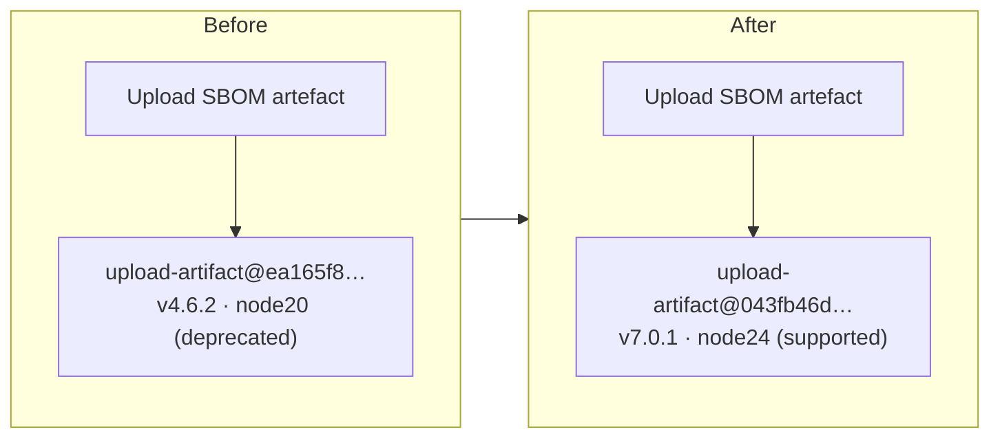

# Bump `actions/upload-artifact` off the deprecated Node 20 runtime

## Summary

The "Upload SBOM artefact" step in `.github/workflows/deploy.yml` was pinned to
`actions/upload-artifact@ea165f8d65b6e75b540449e92b4886f43607fa02` (v4.6.2),
whose `action.yml` declares `runs.using: node20`. `node20` was force-upgraded on
GitHub-hosted runners on 2026-06-02 and is removed entirely on 2026-09-16, so
this SHA-pinned step emitted a deprecation warning on every Pages deploy and
would hard-break in September 2026 — no tag movement can rescue a commit pin.

This bumps the pin to `actions/upload-artifact@043fb46d1a93c77aae656e7c1c64a875d1fc6a0a`
(v7.0.1, `runs.using: node24`), keeping the 40-character SHA pin per the
security-hardening policy. v7.0.1 was published 2026-04-10, well outside the
24-hour quarantine, and matches the `actions/upload-artifact@v7` build already
wrapped internally by `actions/upload-pages-artifact` in the same workflow — so
the two upload paths now converge on the same major. This was the last `node20`
step remaining in `deploy.yml` (the neighbouring steps were migrated in
#295–#297).

Closes #555.

## Evidence

Backend/CI-only change — no web interface to screenshot. Verified against the
raw `action.yml` at the chosen commit (`runs.using: node24`) and by the full
quality gate (`./quality.sh`) passing with **1123 tests, 0 failures**.

Runtime state before and after:

## Test Plan

- Added `tests/workflow_upload_artifact_node24_test.ts`, mirroring the existing
  `configure-pages` / `upload-pages-artifact` currency tests. It parses every
  workflow YAML and asserts that each `actions/upload-artifact@<sha>` reference
  (a) is not the deprecated v4.6.2 Node 20 SHA and (b) resolves to the v7.0.1
  Node 24 SHA. The finder is anchored on `actions/upload-artifact@` so it never
  matches the distinct `upload-pages-artifact` action.
- Confirmed the two behavioural tests fail against the unfixed workflow (Node 20
  pin) and pass after the bump — a genuine regression guard.
- `./quality.sh` passes cleanly: fmt, lint, type check, and all 1123 tests.
