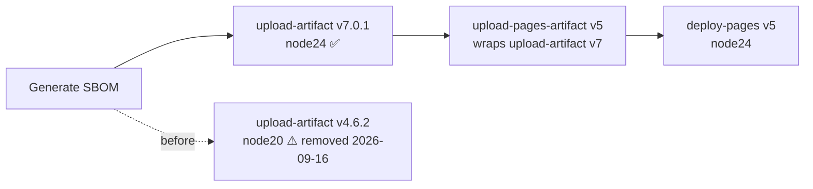

# Bump `actions/upload-artifact` to the Node 24 runtime in `deploy.yml`

## Summary

`.github/workflows/deploy.yml` pinned the "Upload SBOM artefact" step to
`actions/upload-artifact@ea165f8d` (v4.6.2). The `action.yml` at that commit
declares `runs.using: node20` — a runtime GitHub force-upgraded on hosted
runners on 2026-06-02 and removes entirely on 2026-09-16. Because the pin is a
commit SHA, no tag movement can ever pull in a fixed runtime, so the break was
guaranteed unless the pin was bumped.

Repinned to `actions/upload-artifact@043fb46` (v7.0.1), keeping the 40-char SHA
pin required by the security-hardening policy (#190). This was the last `node20`
step in the workflow — the neighbouring `configure-pages` v6,
`upload-pages-artifact` v5 and `deploy-pages` v5 steps were migrated in
#295–#297. It also converges the two upload paths, since `upload-pages-artifact`
v5 already wraps `upload-artifact` v7 internally.

Closes #555.

## Evidence

Verification performed against the raw `action.yml` at each candidate commit,
not the version comment:

| Version | SHA        | `runs.using` | Published  |
| ------- | ---------- | ------------ | ---------- |
| v4.6.2  | `ea165f8d` | `node20`     | (current)  |
| v7.0.0  | `bbbca2dd` | `node24`     | 2026-02-26 |
| v7.0.1  | `043fb46d` | `node24`     | 2026-04-10 |

v7.0.1 was published on 2026-04-10, far beyond the 24-hour external-dependency
quarantine window.

This is a CI workflow change with no web interface, so no screenshot applies.
Evidence is the test suite: `./quality.sh` passes cleanly (1146 tests, 0
failures), and the four new tests fail against the unfixed workflow and pass
after the bump.

## Test Plan

Added `tests/workflow_upload_artifact_node24_test.ts`, which parses every
workflow YAML file and asserts:

- `at least one workflow uses actions/upload-artifact` — guards against the
  suite silently passing if the step is ever deleted.
- `no workflow pins the deprecated Node 20 build` — regression test; fails
  against the pre-fix `ea165f8d` pin.
- `every reference pins the Node 24 build` — pins the expected `043fb46d` SHA.
- `every reference is pinned to a 40-char SHA` — preserves the SHA-pinning
  policy so a future bump cannot regress to a floating tag.
