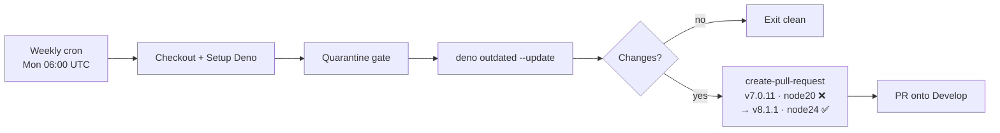

# PR Summary — Issue #556

## Summary

`.github/workflows/upgrade-dependencies.yml` pinned
`peter-evans/create-pull-request@22a9089034f40e5a961c8808d113e2c98fb63676`
(v7.0.11), whose `action.yml` declares `runs.using: node20`. GitHub
force-upgraded `node20` on hosted runners on 2026-06-02 and removes it entirely
on 2026-09-16, which would silently break the weekly Deno dependency-bump PR (a
scheduled workflow has no PR surface on which a failure would be noticed).

Bumped the pin to **v8.1.1** (`5f6978faf089d4d20b00c7766989d076bb2fc7f1`), which
declares `runs.using: node24`. The 40-character SHA pin is preserved, so the
supply-chain hardening from #190 is unchanged. Closes #556.

Verification performed against the GitHub API, not the version comment:

- `action.yml` at `5f6978fa…` declares `runs.using: 'node24'`.
- v8.1.1 was published 2026-04-10, far outside the 24-hour external-dependency
  quarantine window (#1613).
- Every input this workflow passes (`token`, `branch`, `base`, `title`, `body`,
  `commit-message`, `committer`, `author`, `delete-branch`) still exists in
  v8.1.1 with unchanged semantics; the v8.0.0 release notes list no input
  deprecations, only the Node 24 runtime move (and an Actions Runner ≥ v2.327.1
  requirement that affects self-hosted runners only — this job runs on
  `ubuntu-latest`).



## Evidence

Backend/CI-only change — there is no web interface to screenshot. Evidence is
the test suite plus the upstream runtime verification above.

New tests fail against the unfixed workflow and pass after the bump:

```text
# before the fix
no workflow pins the deprecated Node 20 `create-pull-request` build (#556) ... FAILED
  Found deprecated Node 20 peter-evans/create-pull-request pin(s):
    upgrade-dependencies.yml: 22a9089034f40e5a961c8808d113e2c98fb63676
every `create-pull-request` reference pins the Node 24 build (#556) ... FAILED
FAILED | 1 passed | 2 failed

# after the fix — full gate
./quality.sh → ok | 1148 passed | 0 failed
==> OK
```

The existing pinning and token gates stay green, confirming the fix did not
loosen the supply chain or change authentication:

- `workflow_action_sha_pinning_test.ts` — every `uses:` is still a 40-char SHA.
- `workflow_pr_creator_token_test.ts` — still prefers `ACTIONS_PUSH`, falling
  back to `GITHUB_TOKEN`.

## Test Plan

Added `tests/workflow_create_pull_request_node24_test.ts`, mirroring the
existing `workflow_*_node24_test.ts` runner-currency gates:

- `at least one workflow uses peter-evans/create-pull-request (#556)` — guards
  against the gate silently passing on zero references.
- `no workflow pins the deprecated Node 20 create-pull-request build (#556)` —
  regression test for this issue; fails on the v7.0.11 SHA.
- `every create-pull-request reference pins the Node 24 build (#556)` —
  forecloses drift to any other unverified pin.

No existing tests were modified or removed.

## Security Self-Check

- SHA pin preserved (40 hex chars); no move to a mutable tag or branch ref.
- Runtime verified from the raw `action.yml` at the pinned commit, not the tag
  comment.
- Quarantine honoured: chosen release published ~3.5 months ago.
- No secrets, credentials, or hidden files staged; token wiring unchanged.
