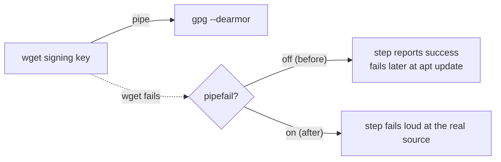

# PR Summary — Issue #557

## Summary

Added the standard `set -Eeuo pipefail` prologue to the two multi-line `run:`
blocks that omitted it: `a11y.yml`'s "Install system Chrome" step and
`semver-bump.yml`'s "Commit Version Update" step. GitHub runs `run:` scripts
under `bash -e {0}`, so `-e` applies but `pipefail`, `-u`, and `-E` do not — a
failing `wget` in `wget … | sudo gpg --dearmor …` was masked by the exit status
of the last command in the pipeline and only resurfaced later as a confusing apt
signature error. Closes #557.

The "Push Version Update" step is deliberately failure-tolerant via `|| echo`
and is intentionally left unchanged.

## Evidence

CLI/CI-only change — no web interface to screenshot. Verified by the new
behaviour tests below.



Test run:

```text
a11y 'Install system Chrome' enables pipefail/nounset/errtrace (#557) ... ok
semver-bump 'Commit Version Update' enables pipefail/nounset/errtrace (#557) ... ok
ok | 1150 passed | 0 failed
```

`./quality.sh` passes cleanly (fmt, lint, type check, bash syntax, 1150 tests).

## Test Plan

- Added `tests/workflow_run_prologue_test.ts` with two tests. Each extracts the
  leading `set …` lines from the step's `run:` block, executes them under the
  same `bash -e` invocation GitHub Actions uses, and asserts that `errexit`,
  `errtrace`, `nounset`, and `pipefail` are actually enabled — a behavioural
  check of the resulting shell options, not a grep for the literal prologue.
- Both tests fail against the unfixed workflows (reporting
  `errtrace, nounset, pipefail` off) and pass after the change.

## Security Self-Check

- No new external input, dependencies, or secrets. The change strengthens
  failure detection in CI scripts (fail loud rather than silently continuing).
