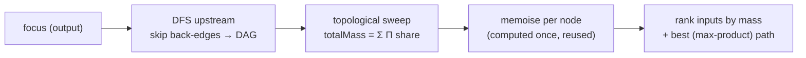

# Rewrite exhaustive ranked-contribution walk as memoised DAG propagation

## Summary

The `exhaustive` mode of `computeTopContributingInputs`
(`docs/shared/graph_analysis.js`) — the sole cost of the post-download
`buildSubgraphSource` work for the `/subgraph/` view — used to **enumerate every
upstream path** from the output. That is exponential in a fanned-out network and
froze for tens of seconds on the published snapshot (4 120 neurons / 21 443
synapses / 1 output), while still returning `truncated: true`.

This replaces that path enumeration with a **memoised DAG propagation**. On a
DAG an observation's contribution is the sum, over every path from the focus to
that input, of the product of per-hop shares — a value that can be computed
**once per node and reused**, giving cost linear/near-linear in synapses. The
ranking semantics are preserved: same scores, same ordering, and the same
highest-product best path per input. Back-edges are skipped exactly as the old
walk skipped predecessors already on its path, so recurrent networks still
terminate. Unlike the old capped walk, the new ranking is **complete**
(`truncated: false`) rather than stopping early.

The default (non-`exhaustive`) mode used by every other view is **untouched** —
that code path is unchanged and pinned by a byte-for-byte snapshot test.

Closes #559.

## Evidence

Performance-task before/after on the **published desktop snapshot**
(`scripts/benchmark_subgraph_559.ts`, run against
`https://stsoftwareau.github.io/NEAT-AI-Snapshot/snapshot.json.gz`):

```
Network: 4120 neurons / 21443 synapses / 1 output(s)

before (old exhaustive walk)      : 35.33 s
after  (memoised DAG propagation) : 17.8 ms
speed-up                          : 1983.6x
full buildSubgraphSource (new)    : 89.5 ms
ranked paths (new)                : 2162
top-20 ranking agrees before↔after: yes
```

The exhaustive walk drops from **tens of seconds to ~18 ms**, and the whole
`buildSubgraphSource` completes in **~90 ms** — well under a second, matching
the acceptance criterion. The issue quoted ~71 s on the reporter's desktop; this
run measured ~35 s on the benchmark machine — same order of magnitude (tens of
seconds), same collapse to milliseconds. The `before` walk uses the exact caps
`buildSubgraphSource` passed (`maxDepth 24`, `maxWork 60000`). The top-20
ranking agrees before↔after; the old walk truncated beyond that head, whereas
the new propagation ranks the full network.

This is a pure computation change with **no visual change** to the `/subgraph/`
view — the extracted subgraph is a deterministic function of the same ranking,
so no screenshot is warranted. Correctness is covered by tests below.



## Test Plan

New `tests/graph_analysis_exhaustive_test.ts`:

- **Exhaustive matches the pre-#559 walk** — an embedded faithful copy of the
  old path-enumeration walk (`referenceExhaustiveWalk`) is the golden reference;
  the new implementation must return the same set, ordering, scores and best
  paths on hand-built small DAGs (a diamond and a deeper graph with a shared
  intermediate).
- **Hand-computed scores and best paths** — exact binary-fraction assertions on
  the diamond so a bug in the reference copy cannot mask a regression.
- **Recurrent back-edge** — a cyclic fixture must terminate and return
  normalised shares summing to 1.
- **Non-exhaustive mode unchanged** — a byte-for-byte snapshot of the default
  path (exhaustive omitted).

Regression coverage already exercising the exhaustive path stays green:
`tests/subgraph_view_test.ts` (24 cases through `buildSubgraphSource`),
`tests/attribution_walk_test.ts`.

`./quality.sh` passes (`deno fmt --check`, `deno lint`, `deno check`,
`deno test -A`): **1120 tests, 0 failed**.
