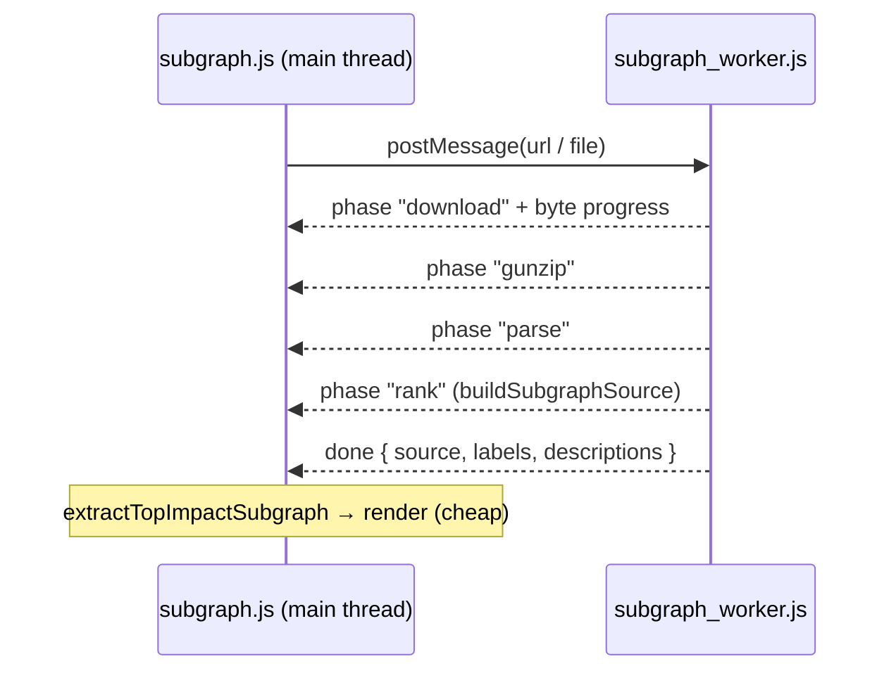

# Move subgraph download/parse/rank off the main thread with honest progress

## Summary

The top-impact subgraph page ran the whole `download → gunzip → parse → rank`
pipeline on the main thread, so a phone froze — often for many seconds — behind
a "Loading…" spinner while a 15.9 MB gzipped snapshot was fetched and
`buildSubgraphSource` ranked it. This change dispatches that entire pipeline to
a **Web Worker** so the page stays interactive, and drives the existing progress
bar **honestly** through every phase. On failure the worker reports loudly
rather than leaving a hung spinner (Issue #3234). Closes #560.

What changed:

- **New DOM-free pipeline** `docs/shared/subgraph_derivation.js` —
  `deriveSubgraphFromRequest(request, { onPhase, onProgress })` runs download →
  gunzip → parse → rank for a URL (with CORS fallbacks) or an uploaded `File`,
  emitting a distinct phase for each step. Shared by the worker and the
  main-thread fallback, so it is unit-tested directly under Deno.
- **New Web Worker** `docs/subgraph/subgraph_worker.js` (module worker) runs the
  pipeline off the main thread and streams `phase` / `progress` / `done` /
  `error` messages back.
- **New client** `docs/shared/subgraph_worker_client.js` —
  `runSubgraphDerivation(worker, request, handlers)` owns the message round-trip
  and the honest `phaseProgressPercent(phase, fraction)` mapping (ordered,
  non-overlapping 0..1 slices so the bar only ever moves forward).
- **`docs/subgraph/subgraph.js`** no longer calls `buildSubgraphSource`
  synchronously. It posts a request to the worker, awaits the ranked source, and
  keeps only the cheap `extractTopImpactSubgraph` (re-run on every control
  change) on the main thread. Browsers without module-Worker support fall back
  to the same pipeline on the main thread.
- **`docs/shared/snapshot_loader.js`** — `fetchSnapshotJson` /
  `readSnapshotFile` gained an optional `onPhase` hook (download → gunzip →
  parse) so the phases are reported from the one place the work happens (DRY).
- **`docs/sw.js`** precaches the new worker and shared modules (Issue #126).

## Evidence

This is a UI/perf change. The default published snapshot ranks and renders on a
390 px phone viewport, and the browser confirms the derivation ran in the worker
(`subgraph_worker.js`), not on the main thread:

Captured via `playwright` against a local server; the page emitted a `worker`
event for `http://localhost:8091/subgraph/subgraph_worker.js?v=…`, proving the
heavy pipeline ran off the main thread.

## Test Plan

Added to `tests/subgraph_view_test.ts` (section **(f)**):

- `phaseProgressPercent advances monotonically through every phase` — each phase
  is a distinct forward step; download interpolates and clamps; rank completes
  the bar.
- `runSubgraphDerivation returns the worker's result via a message round-trip` —
  the result comes back across the worker boundary (not computed on the calling
  thread), the request is posted, and `download,gunzip,parse,rank` each fire
  once in order.
- `runSubgraphDerivation surfaces a worker error message loudly` and
  `… rejects on a worker 'error' event` — a swallowed worker error would fail
  these; the spinner never hangs.
- `deriveSubgraphFromRequest walks download→gunzip→parse→rank for a URL` and
  `… gunzip→parse→rank for an uploaded .gz file` — the real pipeline (stubbed
  `fetch` / a real `File`) reports each phase in order and returns the ranked
  source plus tooltips.
- `deriveSubgraphFromRequest fails loud when the download fails` — an HTTP 500
  throws naming the fault rather than yielding an empty result.

Added to `tests/app_module_loads_test.ts`: `subgraph_worker.js` is in the
`ENTRY_MODULES` smoke test, so a broken worker script URL or import failure
fails CI.

`./quality.sh` passes: `deno fmt --check`, `deno lint`, `deno check` over the
repo, and `deno test -A` (1128 tests) all green. markdownlint clean. The
`?noAutoLoad=1` boot path is unchanged (no worker is created), so the pa11y-ci
gate still settles.

## Note on the ~10 s phone target

The acceptance "interactive within ~10 s on a phone" has no automated harness;
it is verified manually on a mobile-class device. The regression guard is the
off-main-thread assertion set above — a regression back to synchronous
main-thread ranking, a phase that stops reporting progress, or a swallowed
worker error fails those tests before merge.
