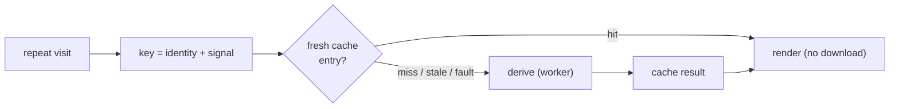

# On-device cache for the derived subgraph (Issue #561)

## Summary

Repeat visits to the top-impact subgraph view re-ran the whole expensive
pipeline — download → gunzip → parse → the exhaustive attribution **rank** —
even for a snapshot the browser had already processed. This caches the
parsed/derived result on-device so a repeat visit for the **same** snapshot
skips that pipeline and reaches interactive nearly instantly.

`Closes #561.`

The change is deliberately kept **off the #553 critical path** (it is the
optional / nice-to-have sub-issue): the cache can only ever make a repeat visit
faster, never break a first visit.

What changed:

- **New `docs/shared/subgraph_cache.js`** (DOM-free, testable under Deno):
  - `subgraphCacheKey` keys on snapshot **identity** (URL, normalised; or
    uploaded file name).
  - Freshness is a separate **content/version signal** — `fetchVersionSignal` (a
    HEAD request's `ETag` / `Last-Modified`, no body download) for URLs, and
    `fileVersionSignal` (name + size + mtime) for uploads.
  - `loadCachedDerivation` / `saveCachedDerivation` / `deriveSubgraphCached`
    orchestrate hit/miss, with a `CACHE_SCHEMA_VERSION` guard.
  - `createIndexedDbStore` is the browser backend — IndexedDB natively stores
    the structured-cloneable derived artefact (unlike Cache Storage, which only
    holds HTTP responses).
- **`docs/subgraph/subgraph.js`** wires the cache around the existing worker
  derivation: compute the signal, serve a fresh cached result on a hit, else
  derive and cache. A cache hit shows "Loaded the cached subgraph" and jumps the
  progress bar to done.
- **`docs/sw.js`** precaches the new shared module (Issue #126 convention).
- **`README.md`** documents the cache with a flow diagram.

**Invalidation** is signal-driven: a changed snapshot (new ETag, or an edited
upload) changes the signal, so the stale entry is bypassed and a fresh
derivation runs — a stale subgraph is never shown. **Fail-open** by
construction: a miss, an eviction, a corrupted entry, no IndexedDB, an
unavailable signal, or any store fault falls straight through to the normal load
with no thrown error.

## Evidence

This is primarily a caching/behaviour change (no new layout). The one
user-visible addition is a status message on a cache hit; the observable
guarantees — invalidation, fail-open, hit correctness — are pinned by the new
unit tests below.

Cache decision flow:

The subgraph page boots cleanly with the new module imported (served locally,
`?noAutoLoad=1`, **zero console errors**):

## Test Plan

New `tests/subgraph_cache_test.ts` (9 cases) covers the three failure modes the
issue calls out, plus keys/signals:

- **(1) Stale cache served** —
  `a changed signal invalidates the cache and runs
  the fresh load path`: cache
  a result, change the signal (and separately the schema version), assert the
  cached entry is bypassed and the fresh derivation runs.
- **(2) Miss / eviction / corruption fails open** —
  `an empty cache falls
  through…`, `a corrupted cache entry is ignored…`,
  `a throwing store never
  breaks the load…`,
  `with no signal the cache is bypassed entirely`: assert the normal derivation
  completes with no thrown error.
- **(3) Cache hit correctness** —
  `a cache hit returns a result deep-equal to a
  fresh derivation`: a real
  `deriveSubgraphFromRequest` derivation (stubbed `fetch` over a gzipped
  fixture) is cached, the repeat visit is a hit (no re-derive), and its result
  deep-equals an independent fresh derivation.

Full gate: `deno fmt --check`, `deno lint`, `deno check`, and `deno test -A`
(**1142 passed / 0 failed**) all green.
