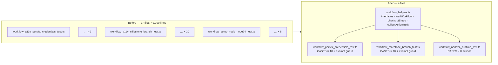

# Consolidate 27 near-duplicate workflow policy tests

## Summary

The workflow policy tests were organised one file per workflow per policy,
producing three families of near-identical files — 9 ×
`workflow_*_persist_credentials_test.ts`, 10 ×
`workflow_*_milestone_branch_test.ts` and 8 × `workflow_*_node24_test.ts`. Every
file re-declared the same `Workflow*` interfaces, `loadWorkflow` helper and
assertions, differing only in a workflow name, a job key and an issue reference.
Tightening a policy meant editing nine or ten files in lockstep, and a missed
copy silently left one workflow unguarded.

Each family is now a single data-driven suite iterating a case table with
`t.step`, and the parsing scaffolding lives once in `tests/workflow_helpers.ts`.
Every original assertion is preserved, and each case carries its originating
issue reference into the step name so the per-issue provenance survives. 2,733
lines deleted, 651 added. Closes #588.

## Evidence

This is a test-suite change with no web interface, so there is no screenshot.
Evidence is the mutation run below plus a clean `./quality.sh`.

### Mutation evidence — the consolidated gates still fail on a real violation

Four deliberate breakages were introduced, the suites run, then reverted:

| Mutation                                             | Result                                                              |
| ---------------------------------------------------- | ------------------------------------------------------------------- |
| Removed `persist-credentials: false` from `a11y.yml` | `guarded checkouts do not persist the GITHUB_TOKEN` → **FAILED**    |
| Narrowed `a11y.yml` branches to `["*"]`              | `gates run on milestone/<slug> PRs` → **FAILED**                    |
| Reverted `actions/setup-node` to the Node 20 SHA     | `no workflow pins a deprecated Node 20 build` → **FAILED**          |
| Added a new workflow with an unguarded checkout      | both `… guarded or documented as exempt (#588)` guards → **FAILED** |

`./quality.sh` passes cleanly: `ok | 1107 passed (64 steps) | 0 failed`.

### Coverage changes

- **Gained:** `bash-syntax.yml` was already setting `persist-credentials: false`
  but had no test; it is now a case row. The two new exhaustiveness guards
  derive coverage from the `.github/workflows/` listing, so a newly added
  workflow must either satisfy the policy or be listed in `EXEMPT` with a
  written reason.
- **Documented exemptions:** `semver-bump.yml` and `upgrade-dependencies.yml`
  push back to the repository, so their checkout credential must persist;
  `gitleaks.yml` was never part of the persist-credentials policy and is
  unchanged here. `semver-bump.yml` deliberately gates only PRs into `Develop`,
  so it is exempt from the milestone-branch policy.
- **Lost:** nothing — every assertion from the 27 deleted files is carried over.

## Test Plan

Added:

- `tests/workflow_persist_credentials_test.ts` — 10 guarded jobs × 2 policy
  tests, plus `every workflow checkout is guarded or documented as exempt` and
  `no stale workflow entries in the policy tables`.
- `tests/workflow_milestone_branch_test.ts` — 10 gates × 2 policy tests (matches
  `milestone/<slug>`; still matches `Develop`/`main`/`feature-x`), plus the
  coverage and stale-entry guards.
- `tests/workflow_node24_runtime_test.ts` — 8 actions × 3 policy tests (action
  still referenced; deprecated Node 20 SHA never pinned; every reference pins
  the Node 24 SHA).
- `tests/workflow_helpers_test.ts` — 8 tests over the new shared helpers,
  covering happy paths (`listWorkflowFiles` sorted YAML-only listing,
  `loadWorkflow` parsing a real workflow), the error path (`loadWorkflow`
  rejects for a missing file rather than yielding an empty document), and edge
  cases (`checkoutSteps` on undefined/empty jobs, `collectActionRefs` anchoring
  so `actions/upload-artifact` never matches `actions/upload-pages-artifact`).

Removed: the 27 superseded per-workflow files.

Modified: `tests/workflow_shellcheck_gate_test.ts` — doc comment now points at
the consolidated suite instead of the deleted file.
