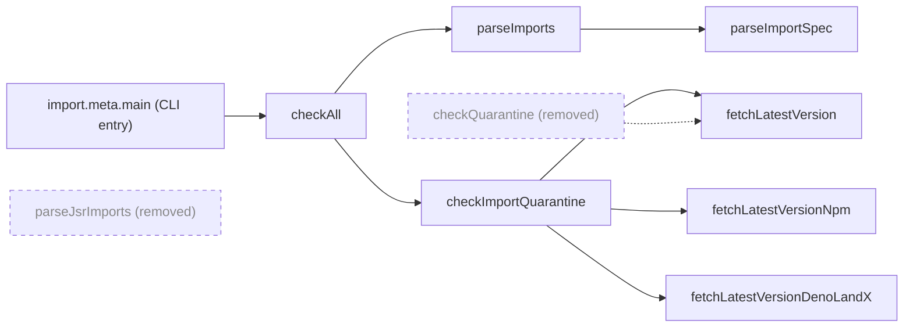

# Remove superseded JSR-only quarantine helpers

## Summary

Deleted the dead exports `parseJsrImports` and `checkQuarantine` from
`scripts/jsr_quarantine_check.ts`. Both were the JSR-only first generation of
the dependency quarantine gate, superseded by the multi-registry pipeline the
script actually runs — the CLI entry (`import.meta.main` → `checkAll`) parses
with `parseImports`/`parseImportSpec` and checks with `checkImportQuarantine`,
which cover JSR, npm and deno.land/x. Neither legacy function had a caller in
the production path, inside its own file, or in `.github/workflows/`; the only
references were their own tests. Closes #592.

Rather than deleting the eight legacy tests, they are **repointed** at the
successor functions, so no behavioural coverage is lost. This also closes a real
gap: `checkImportQuarantine` previously had npm, deno.land/x and raw-url cases
but **no JSR case** — the repointed tests now exercise the JSR branch directly
(fresh/aged windows, yanked-version skipping, bare-array response shape, non-OK
status, no-usable-versions).

## Evidence

This is a CLI/supply-chain script with no web interface, so there is no
screenshot. Verification was by removal-safety analysis plus the test suite.

Call graph before and after — the legacy pair was already an orphan branch:

Safety checks run before removal:

- Repo-wide grep across `.ts`, `.js`, `.html`, `.yml`, `.sh` and `.md` for both
  symbols — the only non-declaration hits were the test imports (plus a
  historical mention in `docs/archive/pr-summary-189.md`, left untouched as a
  record).
- `.github/workflows/upgrade-dependencies.yml` invokes the script only via its
  CLI entry, never by symbol name — no dynamic or reflective use.
- `./quality.sh` (fmt, lint, type check, full test suite): **1105 passed, 0
  failed**.
- `deno test -A tests/jsr_quarantine_check_test.ts`: **32 passed, 0 failed**,
  both before and after the deletion.

## Test Plan

No tests were removed. Modified in `tests/jsr_quarantine_check_test.ts`:

| Was                                           | Now                                                                           |
| --------------------------------------------- | ----------------------------------------------------------------------------- |
| `parseJsrImports extracts scope/name …`       | `parseImports extracts scope/name from JSR import specifiers`                 |
| `parseJsrImports deduplicates packages …`     | `parseImports deduplicates JSR packages referenced by multiple entrypoints`   |
| `checkQuarantine flags a package … younger …` | `checkImportQuarantine flags a JSR package … younger …` (also asserts `kind`) |
| `checkQuarantine clears a package … older …`  | `checkImportQuarantine clears a JSR package … older …`                        |
| `checkQuarantine ignores yanked versions …`   | `checkImportQuarantine ignores yanked JSR versions …`                         |
| `checkQuarantine accepts bare-array …`        | `checkImportQuarantine accepts the bare-array JSR response shape`             |
| `checkQuarantine throws … non-OK status`      | `checkImportQuarantine throws … non-OK status`                                |
| `checkQuarantine throws … no usable versions` | `checkImportQuarantine throws … no usable versions`                           |

Each repointed test keeps its original fixtures and assertions, passing a
`{ kind: "jsr", scope, name }` import instead of a bare `JsrPackage`.
