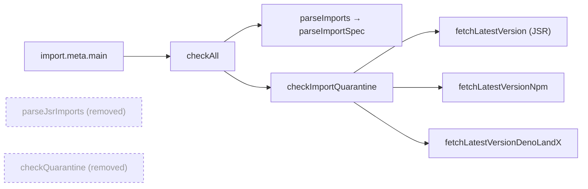

# Remove superseded JSR-only quarantine helpers

## Summary

Deleted the dead exports `parseJsrImports` and `checkQuarantine` from
`scripts/jsr_quarantine_check.ts`. Both were the JSR-only first generation of
the quarantine gate, superseded by the multi-registry pipeline the script
actually runs — the CLI entry (`import.meta.main` → `checkAll`) parses with
`parseImports`/`parseImportSpec` and checks with `checkImportQuarantine`, which
handle JSR, npm and deno.land/x. Neither legacy function had a caller anywhere
outside its own tests. Closes #592.

## Evidence

Backend/CLI change — no web interface to screenshot. Verified instead by a
repo-wide grep (including `.github/` workflows) confirming the only references
were the test imports, and by a clean `./quality.sh` run: **1099 tests passed, 0
failed**.

Supply-chain note: the gate's runtime behaviour is unchanged — no code path
reachable from the CLI entry or from
`.github/workflows/upgrade-dependencies.yml` touched either removed function.

## Test Plan

Tests were repointed at the surviving multi-registry API rather than simply
dropped:

- **Added** `checkImportQuarantine blocks a fresh JSR release` and
  `checkImportQuarantine clears an older JSR release` in
  `tests/jsr_quarantine_check_test.ts`. These replace the two `checkQuarantine`
  age-window tests and close a genuine gap — `checkImportQuarantine` previously
  had direct block/clear coverage for npm and deno.land/x but not for JSR.
- **Removed** the seven tests that only existed to exercise the deleted
  functions. Their behaviour remains covered elsewhere:
  - `parseJsrImports` extraction and dedup →
    `parseImports extracts and dedupes
    across every ecosystem` (includes two
    `jsr:@std/yaml` entrypoints deduping to one).
  - `checkQuarantine` yanked-version skipping, bare-array response shape, non-OK
    status, and no-usable-versions → the five `fetchLatestVersion` tests, which
    exercise the same registry-response handling.
  - End-to-end JSR behaviour →
    `checkAll preserves existing JSR-only behaviour
    (regression)`.

`./quality.sh` passes cleanly (fmt, lint, type check, 1099 tests).
