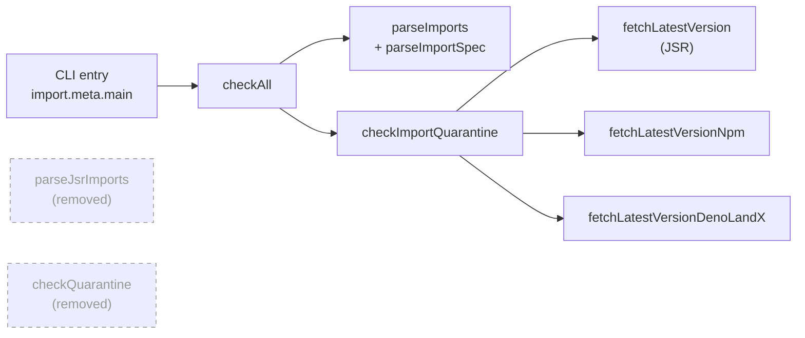

# 🟢 dead-code: remove superseded JSR-only exports from `jsr_quarantine_check.ts`

## Summary

Deleted `parseJsrImports` and `checkQuarantine` from
`scripts/jsr_quarantine_check.ts`. Both were the JSR-only first generation of
the dependency quarantine gate (#189), superseded by the multi-registry pipeline
added in #223 — the CLI entry (`import.meta.main` → `checkAll`) parses with
`parseImports`/`parseImportSpec` and checks with `checkImportQuarantine`, which
cover JSR, npm and deno.land/x. Neither legacy function had a caller in any
production path, in its own file, or in `.github/workflows/`. Closes #592.

No behaviour change: the gate's CLI output, exit codes and fail-closed handling
of raw `https://` specifiers are untouched.

## Evidence

Backend/CLI change only — no web interface to screenshot. Verified by the test
suite and the full quality gate.

Removal safety was confirmed by a repo-wide grep across `docs/`, `helpers/`,
`scripts/`, `tests/` and `.github/`: after this change the only remaining
occurrence of either name is the explanatory comment in the test file (plus the
historical `docs/archive/pr-summary-189.md`, deliberately left as-is).

Quality gate: `./quality.sh < /dev/null` → `1105 passed (64 steps) | 0 failed`,
`==> OK`.

## Test Plan

No test was deleted. The eight tests that exercised the removed pair were
**repointed** at the surviving multi-registry API in
`tests/jsr_quarantine_check_test.ts`, so the JSR scenarios stay covered and
`checkImportQuarantine` gains direct JSR-kind cases alongside its existing npm
and deno.land/x ones:

| Old test                                         | Now exercises                                              |
| ------------------------------------------------ | ---------------------------------------------------------- |
| `parseJsrImports extracts scope/name …`          | `parseImports` (JSR entries, via a `jsrPackagesOf` helper) |
| `parseJsrImports deduplicates …`                 | `parseImports` dedupe across entrypoints                   |
| `checkQuarantine flags … younger than window`    | `checkImportQuarantine` with `kind: "jsr"` — blocked       |
| `checkQuarantine clears … older than window`     | `checkImportQuarantine` with `kind: "jsr"` — cleared       |
| `checkQuarantine ignores yanked versions`        | `checkImportQuarantine` yanked-version skipping            |
| `checkQuarantine accepts bare-array shape`       | `checkImportQuarantine` bare-array JSR response            |
| `checkQuarantine throws on non-OK status`        | `checkImportQuarantine` registry error propagation         |
| `checkQuarantine throws with no usable versions` | `checkImportQuarantine` no-usable-versions error           |

The repointed JSR-blocked case also asserts `r.kind === "jsr"`, which the legacy
test could not meaningfully check (the old function hard-coded the field).

- `deno test --allow-read tests/jsr_quarantine_check_test.ts` →
  `32 passed | 0 failed`
- `./quality.sh < /dev/null` → `1105 passed | 0 failed`
