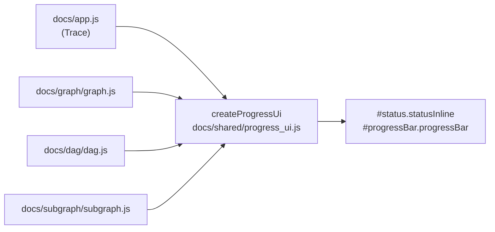

# Share one status/progress widget controller across views (Issue #597)

## Summary

The Trace, DAG, Graph and Subgraph views each carried a private copy of the
`setStatus` / `showProgress` / `updateProgress` / `hideProgress` quadruplet
driving the same DOM contract (`#status.statusInline`, `#progressContainer` >
`#progressBar.progressBar`). The copies had already diverged: Trace and Graph
pulsed an unknown-size load via the `.indeterminate` class, while DAG and
Subgraph faked it with a static 35% bar and had no `.indeterminate` CSS rule at
all; only three of the four null-guarded `setStatus`.

All four views now construct the new shared `docs/shared/progress_ui.js` —
`createProgressUi({ status, progressContainer, progressBar })` — so the widget
rule lives in one place. The deliberate choice the unification forced: DAG and
Subgraph **adopt** the pulsing indeterminate animation
(`.progressBar.indeterminate` added to `dag.css` and `subgraph.css`). A
non-finite percentage now throws a `TypeError` instead of silently painting
`width: NaN%` (fail loud, Issue #3234).

One caller fix came with it: the Subgraph view called `updateProgress(0)`
immediately after `showProgress(true)`, which cancelled the pulse before it was
ever seen — that line is gone, so the honest unknown-size state now shows.

Closes #597.

## Evidence

The snapshot fetch is stalled by `scripts/capture_issue_597_evidence.ts` so the
unknown-size loading state holds; each screenshot is taken only once the live
DOM actually carries `#progressBar.indeterminate`, so it evidences the real code
path rather than a hand-poked class.

DAG view — previously a static 35% bar, now the shared pulse:

Subgraph view — same change:

Trace explorer — unchanged behaviour, now sourced from the shared helper:

`./quality.sh` passes: 1124 tests, 0 failures (fmt, lint, type check, bash
syntax, shellcheck).

## Test Plan

New `tests/progress_ui_test.ts` (13 tests) calls the real `createProgressUi`
against stub elements and asserts observable state:

- `setStatus` writes the message and `statusInline` / `statusInline bad` class;
  coerces nullish messages; is a no-op when the status element is absent (the
  guard drift the issue reported).
- `showProgress(true)` adds `.indeterminate` and leaves the width to CSS;
  `showProgress(false)` / the default clears it and paints `0%`; other classes
  on the bar are preserved.
- `updateProgress` clamps to 0–100, cancels the indeterminate pulse, and throws
  a `TypeError` on `NaN` / `Infinity` / a non-numeric string.
- `hideProgress` hides the container; every call is a safe no-op when the widget
  elements are missing; `createProgressUi()` with no options throws.

Existing suites (DAG, Subgraph, service-worker `STATIC_FILES`, PWA) still pass;
`./shared/progress_ui.js` was added to the SW precache list.
