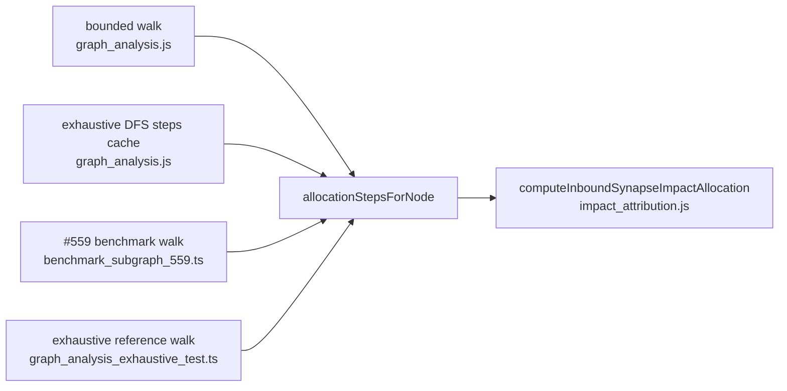

# One inbound-allocation step rule for every walk (#598)

## Summary

The rule for turning a node's raw inbound edges into ranked attribution steps —
build the `computeInboundSynapseImpactAllocation` input (map each edge to
`{ fromUuid, toUuid, weight, meanContribution, contributions }`, fetch the
receiver's squash and recorded-activation envelope), keep only rows with a
finite positive `share`, then cap at `maxInboundPerNode` — was copy-pasted at
four sites: the bounded multi-hop walk and the exhaustive DFS upstream-steps
cache (`docs/shared/graph_analysis.js`), the #559 benchmark's walk
reimplementation (`scripts/benchmark_subgraph_559.ts`) and the exhaustive
reference walk (`tests/graph_analysis_exhaustive_test.ts`).

Their agreement is a correctness requirement, not a coincidence — the cache copy
was annotated "Identical allocation call to the bounded walk, so per-hop shares
match", and the exhaustive-parity test only means anything while the shares
match. A copy that missed an edit (as happened when #513 added the
per-observation `contributions` series) would not fail loudly; it would silently
attribute differently.

All four sites now call one exported helper, `allocationStepsForNode`, in
`docs/shared/graph_analysis.js`. The deliberate differences between the callers
(bounded best-first walk vs memoised DAG propagation vs benchmark loop) stay in
the callers — no per-caller flags were needed. The `docs/app.js`,
`docs/graph/graph.js` and `docs/shared/aggregated_graph_model.js` allocation
calls build their inputs from different sources with different post-processing
and are deliberately untouched.

Behaviour is unchanged: the helper returns `{ uuid, share }` rows ordered
strongest-first, exactly the rows the four copies produced.

Closes #598.

## Evidence

No UI or performance change — this is a pure de-duplication of a shared rule, so
there is nothing to screenshot and no metric to benchmark. The evidence is the
test suite.

`./quality.sh` passes cleanly: `deno fmt --check`, `deno lint`,
`deno check helpers/ scripts/ tests/ docs/`, plus the bash-syntax and shellcheck
gates and the full suite — **1131 tests passed, 0 failed**.

The existing exhaustive-parity tests (`tests/graph_analysis_exhaustive_test.ts`)
are the strongest regression evidence: they compare the production memoised
propagation against the reference walk on hand-built fixtures with exact
binary-fraction shares, and they still agree to the bit after both were pointed
at the shared helper.

## Test Plan

New — `tests/allocation_steps_for_node_test.ts` (7 tests calling the real
helper):

- ranks inbound edges by share, returning `{ uuid, share }` strongest-first;
- caps the fan-out at `maxInboundPerNode`;
- drops non-positive shares;
- returns no steps for empty or missing (`null`) inbound;
- tolerates omitted envelope getters;
- fetches the receiver's squash envelope — a `MAXIMUM` receiver turns an
  additive 50/50 split into a 100/0 win-fraction split (#513), proving both the
  squash getter and the per-observation `contributions` series reach the
  allocation, and both getters are called with the node's uuid;
- matches a direct `computeInboundSynapseImpactAllocation` call on a mixed
  fixture (negative weight, missing `meanContribution`, squash + recorded
  activation envelope, cap applied).

Unchanged and still passing — no existing test was modified or removed except
`tests/graph_analysis_exhaustive_test.ts`, where the reference walk's inline
copy of the step rule was replaced by the shared helper call (its assertions are
untouched):

- `tests/graph_analysis_exhaustive_test.ts` — exhaustive-vs-reference parity,
  hand-computed scores/paths, recurrent back-edge termination, and the
  byte-for-byte non-exhaustive snapshot;
- `tests/attribution_walk_test.ts`, `tests/inbound_allocation_test.ts`.
