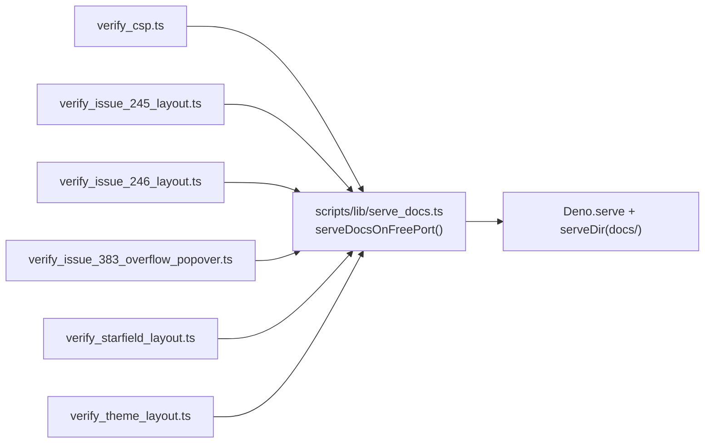

# Extract the serve-docs-on-a-free-port scaffold (Issue #599)

## Summary

Six Playwright verification scripts each re-implemented the same "serve `docs/`
on an ephemeral port" scaffold: a verbatim `freePort()` plus the same
`Deno.serve` + `serveDir({ fsRoot: DOCS, quiet: true })` block. The rule now
lives once in `scripts/lib/serve_docs.ts`:

```ts
export function serveDocsOnFreePort(): DocsServer; // { url, shutdown }
```

Call sites updated — `verify_csp.ts`, `verify_issue_245_layout.ts`,
`verify_issue_246_layout.ts`, `verify_issue_383_overflow_popover.ts`,
`verify_starfield_layout.ts`, `verify_theme_layout.ts`. The module also exports
the `REPO_ROOT` / `DOCS` constants those scripts derived independently, so the
docs path is single-sourced too. A future change to how the scripts stand up
`docs/` (SPA fallback, a CSP test header) is now one edit, not six.

`waitForOverflowMode()` (shared by two scripts) was deliberately left in place —
the issue calls for the helper to be a call, not a parameterised super-helper,
and two call sites do not yet justify the move.

Closes #599.



## Evidence

This is a script refactor with no UI change — the pages themselves are
untouched. Evidence is that the refactored scripts still drive a real headless
browser against the served `docs/` folder:

```
$ deno run -A scripts/verify_csp.ts
Loading http://127.0.0.1:50244/index.html?noSw=1
  → screenshot: docs/evidence/csp-trace.png
  ✓ index.html loaded with no CSP violations
Loading http://127.0.0.1:50244/graph/index.html?noSw=1
  → screenshot: docs/evidence/csp-graph.png
  ✓ graph/index.html loaded with no CSP violations
Loading http://127.0.0.1:50244/starfield/index.html?noSw=1
  → screenshot: docs/evidence/csp-starfield.png
  ✓ starfield/index.html loaded with no CSP violations
```

`scripts/verify_issue_246_layout.ts` and `scripts/verify_starfield_layout.ts`
were also run end-to-end and produced their usual screenshots. The screenshot
below was regenerated by the refactored `verify_csp.ts` in this run:


`./quality.sh` passes: 1110 tests, 0 failures.

## Test Plan

Added `tests/serve_docs_helper_test.ts`, which exercises the real helper (no
source-text greps):

- serves `docs/index.html` over a `http://127.0.0.1:<port>/` URL and asserts a
  200 with HTML content
- returns 404 for a missing path
- allocates a distinct free port per call
- `shutdown()` stops the server accepting connections
- `REPO_ROOT` / `DOCS` resolve to the published `docs/` folder

`deno check scripts/` (run by `quality.sh`) covers the six rewritten scripts,
and `tests/verify_theme_layout_check_test.ts` continues to guard
`verify_theme_layout.ts`.
