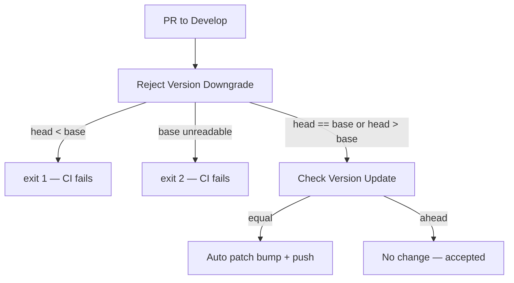

# PR Summary — Refuse `version.json` downgrades vs Develop (#605)

## Summary

`.github/workflows/semver-bump.yml` treated any `CURRENT != BASE` version as a
deliberate bump and skipped. A merge conflict that resolved `version.json` in
favour of Develop's **older** token therefore passed CI and shipped a downgrade
— the failure mode that forced NEAT-AI's floor restore.

This PR adds `scripts/check_version_no_downgrade.ts`, a loud gate that compares
the working-tree `version.json` against the base ref and:

- exits **1** when the head version is strictly **behind** the base,
- exits **0** when the versions are **equal** (the workflow may still
  auto-patch-bump) or the head is **ahead** (accepted as-is, no forced bump),
- exits **2** when either version cannot be read or parsed, so a missing base
  never passes silently.

The workflow runs it as a new `Reject Version Downgrade` step **before** the
existing `Check Version Update` step, so a behind version fails the job rather
than reaching the skip branch. The rule is documented under **Versioning** in
`CONTRIBUTING.md`, including the local command.

Closes #605.

## Evidence

Backend/CI change — no web interface to screenshot. Verified by the test suite
and by running the real gate.



Guard run against this repository (head equals `origin/Develop`):

```text
$ deno run --allow-read --allow-run=git \
    scripts/check_version_no_downgrade.ts --base-ref origin/Develop
version.json 0.1.117 matches the base version; a patch bump may be applied.
guard exit=0
```

Full quality gate:

```text
$ ./quality.sh < /dev/null
...
ok | 1144 passed (64 steps) | 0 failed (8s)

==> OK
```

`actionlint .github/workflows/semver-bump.yml` exits 0.

## Test Plan

Added `tests/version_no_downgrade_test.ts` (13 tests). They call the guard's
real functions and drive the real CLI against throwaway git repositories built
with `git init`, asserting on returned values and process exit codes:

- `parsePackageSemver accepts plain MAJOR.MINOR.PATCH only` — rejects `1.2`,
  `v1.2.3`, `1.2.3-beta.1`, empty.
- `comparePackageSemver orders numerically, not lexicographically` —
  `0.1.117 > 0.1.9`, `0.2.0 < 0.10.0`.
- `comparePackageSemver throws loudly on an unparseable token`.
- `classifyVersionChange labels behind / equal / ahead`.
- `checkVersionNoDowngrade` — rejects a version behind the base, accepts equal
  and ahead versions (acceptance criteria 1–3).
- `readVersionFromJson extracts the version, or null when absent`.
- `main() exits non-zero when version.json is behind the base ref` (exit 1),
  `main() exits zero for equal and ahead versions` (exit 0),
  `main() fails loudly when the base ref cannot be read` (exit 2),
  `main() rejects an unknown flag rather than ignoring it` (exit 2).
- `guard CLI exits 1 on a downgrade and 0 otherwise` — end-to-end `deno run` of
  the script in a temp repository.
- `repository version.json is not behind origin/Develop` — live check, skipped
  when `origin/Develop` is not fetched (shallow CI checkout).

No existing tests were modified or removed.
