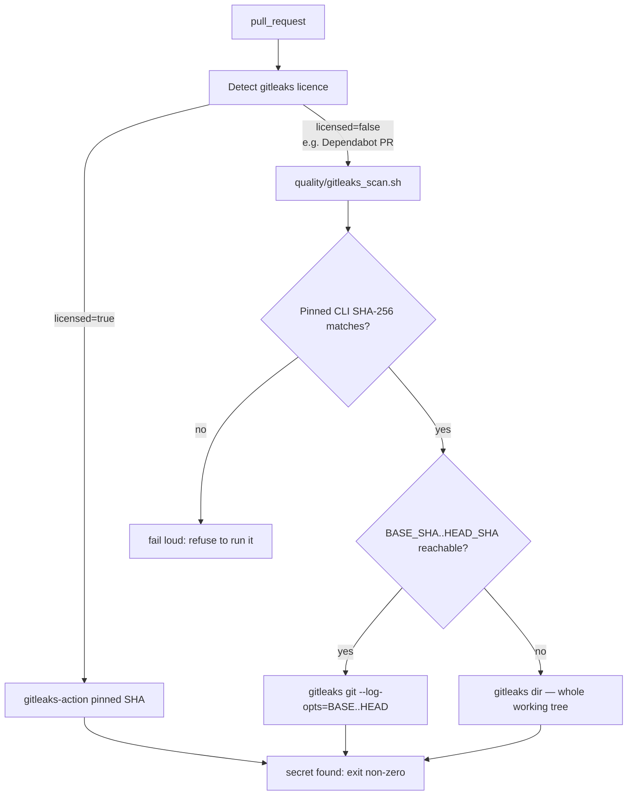

# PR Summary — Issue #609

## Summary

`.github/workflows/gitleaks.yml` scanned only via `gitleaks/gitleaks-action`,
which needs an organisation licence on org-owned repositories. Dependabot-
authored pull requests receive no Actions secrets, so the licence arrived empty
and the action exited with `ErrLicense` before scanning anything — the job went
green over an unscanned diff, which is worse than no gate at all because it
reads as covered.

The workflow now records whether the licence is actually present as a step
output and branches on it. When it is, the licensed action runs as before. When
it is not, the new committed gate script `quality/gitleaks_scan.sh` runs the
free, open-source gitleaks CLI: fetched at a pinned version (8.30.1) and
verified against its published SHA-256 checksum before it is ever executed. When
the pull-request commit range is not reachable in the checkout, the script scans
the whole working tree rather than nothing — so neither branch can report
success over an unscanned diff.

Closes #609.

## Evidence

This is a CI/CLI change with no web interface to screenshot. The evidence is the
test suite below, which executes the committed script end-to-end and executes
the workflow's own licence-detection `run:` block under `bash`.

Scan-path selection:

Local gate runs:

- `./quality.sh` — `1155 passed | 0 failed`, ending `==> OK`
- `actionlint .github/workflows/gitleaks.yml` — clean
- `./quality/shellcheck.sh` and `./quality/bash_syntax.sh` — clean, and both now
  cover the new script

The two pinned checksums were re-verified against
`gitleaks_8.30.1_checksums.txt` from the upstream release before pinning.

## Human action required — make the scan block merges

Adding the fallback makes the scan _run_; it blocks a merge only once its check
is a **required status check** on the ruleset gating the target branch. A human
administrator must do this — the worker's token is deliberately denied the
ruleset permissions.

1. **Settings → Rules → Rulesets**.
2. Edit the ruleset targeting the **default branch**, and the one targeting
   `milestone/**` (create it if absent). Both matter: requiring the check on the
   default branch alone leaves every `milestone/**` pull request merging
   unblocked, and that is where most pull requests land.
3. Enable **Require status checks to pass** and add `Gitleaks / gitleaks`.
4. Save each ruleset.

## Test Plan

New — `tests/gitleaks_licence_fallback_test.ts` (11 tests, all executing real
code against temporary git repositories and a stubbed scanner binary):

- scans the pull-request commit range when both endpoints are reachable, with
  `--exit-code 1` so a find fails the gate
- scans the whole working tree when no range is supplied
- scans the whole working tree when the range is not reachable in the checkout
  (the shallow-clone case that would otherwise scan an empty range and pass)
- propagates a detected leak as a non-zero exit, and asserts the scan really ran
- fails loud when `GITLEAKS_BIN` is not executable
- installs and runs a download whose SHA-256 matches (served from a local
  fixture release, no network)
- refuses a download whose SHA-256 differs, and asserts the unverified binary
  was never executed
- fails loud when the download cannot be fetched at all
- executes the workflow's licence-detection block under `bash` and asserts
  `licensed=false` for an empty licence (the Dependabot case) and
  `licensed=true` for a present one
- asserts the licensed action and the fallback carry mutually exclusive
  conditions, and that the fallback receives the commit range
- asserts the script referenced by the workflow exists

Modified — `tests/workflow_helpers.ts`: the shared `WorkflowStep` interface
gained `id`, `if` and `env` so the policy tests can assert on step conditions.
