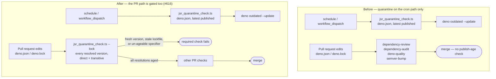

## Summary

The 24-hour dependency-age quarantine — the control `SECURITY.md` names as the
repo's primary supply-chain defence — was wired into
`.github/workflows/upgrade-dependencies.yml` only, which triggers on `schedule`
/ `workflow_dispatch`. A pull request that hand-edited `deno.json` / `deno.lock`
therefore adopted an external package with **no publish-age check anywhere**:
`dependency-review.yml` and `dependency-audit.yml` check disclosed advisories
and licences, `deno-quality.yml` checks the code, and none of them looks at how
long a version has existed.

This PR closes that path:

- **`.github/workflows/dependency-quarantine.yml`** runs
  `scripts/jsr_quarantine_check.ts --lock deno.lock deno.json` on every pull
  request (including `milestone/*` PRs), and the job is added to
  `.github/rulesets/develop.json`'s `required_status_checks` so it cannot be
  bypassed.
- **Resolved-lockfile mode** in `scripts/jsr_quarantine_check.ts` ages the
  versions the branch actually resolves — **transitive packages included**,
  which never appear in `deno.json` — rather than the newest release on the
  registry. That is the right question for a PR: a pinned version only ever gets
  older, so an unrelated PR is unaffected by someone else publishing today,
  while a minutes-old resolution is blocked. It also fails closed when
  `deno.json` declares an import `deno.lock` does not resolve, so a stale
  lockfile cannot hide a newly added dependency.
- **`deno.json` declares `minimumDependencyAge`** (`"age": "P1D"`, excluding the
  internal `@stsoftware` / `@stsoftwareau` scopes), so the policy is visible in
  the manifest and to Deno's own tooling instead of living only in script logic
  and a mutable repository variable.
- **`--allow-env=VIBE_BUMP_QUARANTINE_HOURS`** is now granted at both gate call
  sites. Without it `Deno.env.get` hit a permission error and the step exited 2
  _before age-checking a single package_ — the scheduled gate has never actually
  verified anything (it failed closed, so the weekly bump simply never ran).
  Reproduced locally:
  `deno run --allow-read scripts/jsr_quarantine_check.ts
  deno.json` →
  `Requires env access to "VIBE_BUMP_QUARANTINE_HOURS"`, exit 2.

Closes #616.

## Evidence

Backend/CI change — no web interface to screenshot. Evidence is the gate run
against this branch's real manifest and lockfile, plus the test suite.

The PR gate, run exactly as the workflow invokes it, against the real tree:

```text
$ VIBE_BUMP_QUARANTINE_HOURS=24 deno run --allow-read \
    --allow-env=VIBE_BUMP_QUARANTINE_HOURS \
    --allow-net=api.jsr.io,registry.npmjs.org \
    scripts/jsr_quarantine_check.ts --lock deno.lock deno.json
ok   @std/yaml@1.1.1 aged 5763.0h (>= 24h)
...
ok   npm:playwright@1.60.0 aged 2848.3h (>= 24h)

Quarantine gate (resolved versions): OK (89 cleared, 0 internal skipped).
exit=0
```

89 resolved packages age-checked — 7 direct imports plus 82 transitive ones the
old `deno.json`-only parse never saw. One registry request per package (results
are cached across versions of the same package); the whole run completes in
seconds.

Full gate: `./quality.sh < /dev/null` → **1189 passed, 0 failed**,
`deno fmt
--check`, `deno lint`, `deno check`, bash syntax and ShellCheck all
clean. `actionlint .github/workflows/dependency-quarantine.yml` exits 0.

Where the check now sits:



## Security self-check

- **Original trigger closed.** The issue's trigger — a PR that bumps or adds a
  JSR/npm import to a version published minutes earlier — is now rejected: the
  fresh version appears in `deno.lock`, `checkLockfile` ages it against
  `VIBE_BUMP_QUARANTINE_HOURS`, and the required `dependency-quarantine` check
  fails the PR. **No trivial bypass survives:** adding the import to `deno.json`
  without refreshing `deno.lock` is caught by `checkLockCoverage` (the import is
  "absent from deno.lock"); hiding the package behind a transitive dependency is
  caught because every entry in the lockfile's `jsr` and `npm` sections is
  age-checked, not just direct imports; a raw `https://` specifier, a
  `deno.land/x` specifier with no pinned lock entry, an unparseable lockfile
  key, and a `remote:` lock entry all fail **closed** as unsupported rather than
  passing unchecked; a registry lookup that errors or does not know the pinned
  version throws and exits non-zero rather than being treated as aged; and an
  unknown CLI flag is rejected instead of silently disabling lockfile mode. The
  internal bypass stays exactly as narrow as before — `@stsoftwareau` JSR scope
  and `@stsoftwareau/*` npm scope only.
- **Least privilege.** The gate runs with `--allow-read`, a two-host
  `--allow-net` allowlist and a single-variable `--allow-env`; the workflow
  requests `contents: read` and checks out with `persist-credentials: false`.
- **No secrets or hidden paths staged**; no new third-party dependency; the two
  pinned actions reuse the SHAs already pinned across this repo's workflows.

## Test Plan

Regression tests (all fail against the unfixed code, pass after the fix —
verified by running these three files against `HEAD~1` in a scratch checkout:
the `jsr_quarantine_check` suite fails type-checking because the functions do
not exist, and the other eight cases fail their assertions):

- `tests/workflow_dependency_quarantine_test.ts::a pull-request workflow runs the quarantine gate (#616)`
  — reproduces the reported flaw directly: no PR-triggered workflow ran
  `jsr_quarantine_check.ts`.
- `tests/workflow_dependency_quarantine_test.ts::the quarantine job is a required status check on Develop (#616)`
  — the gate is listed in `develop.json` and names a job that exists.
- `tests/workflow_dependency_quarantine_test.ts::the PR gate ages resolved lockfile versions, not just latest releases (#616)`,
  `::the PR gate reads the configured quarantine window (#616)`,
  `::the PR gate reaches only the registries it age-checks against (#616)`,
  `::every quarantine gate step can read the configured window (#616)` — the
  last one covers the `--allow-env` fault at both call sites.
- `tests/jsr_quarantine_check_test.ts::checkLockfile blocks a freshly published transitive dependency (#616)`
  — the attacker's package, reachable only transitively, is blocked.
- `tests/jsr_quarantine_check_test.ts::checkLockfile reports a stale lockfile as unsupported, never as clean`
  — the deno.json-only bypass fails closed.
- `tests/jsr_quarantine_check_test.ts::gate CLI exits non-zero when deno.json adds a dependency the lockfile never resolved`,
  `::gate CLI exits non-zero on a raw URL dependency it cannot age-check`,
  `::gate CLI exits 0 when every resolved version is internal` — the real CLI,
  end to end, offline and deterministic.
- Further unit cases in `tests/jsr_quarantine_check_test.ts` cover
  `parseLockEntry` (scoped/peer-suffixed/unparseable keys), `parseLockfile` (v5
  and v3/v4 shapes, dedup, `remote:` fail-close), `fetchPublishTimes` (JSR + npm
  maps, loud registry errors), `checkResolvedQuarantine` (ages the pinned
  version, throws on an unknown one), per-package fetch caching,
  `checkLockCoverage` and `parseCliArgs`.
- `tests/deno_json_minimum_dependency_age_test.ts` — the manifest declares a ≥
  24h ISO-8601 floor and excludes internal scopes only.
- Existing suites updated for the new workflow:
  `tests/workflow_persist_credentials_test.ts`,
  `tests/workflow_milestone_branch_test.ts`.
