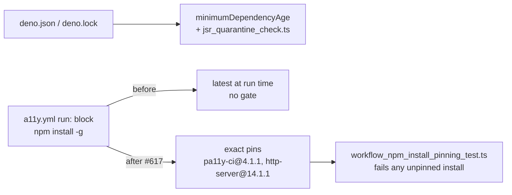

## Summary

`.github/workflows/a11y.yml` installed its two CLI tools with a bare package
name — `npm install -g pa11y-ci http-server` — so the runner executed whatever
version the registry served at that moment, including `pa11y-ci`'s large
transitive tree (`puppeteer-core` and friends). A `run:` block is not a
manifest, so neither `deno.json`'s `minimumDependencyAge` nor
`scripts/jsr_quarantine_check.ts` ever covered this install path: a hijacked or
maliciously republished release would run on the next CI job, unreviewed
(CWE-829).

Both tools are now pinned to exact versions — `pa11y-ci@4.1.1` and
`http-server@14.1.1` — matching the `markdownlint-cli2@0.23.2` pin
`markdown-lint.yml` already uses (#610). Both pinned versions were published far
outside the repository's 24-hour quarantine window (2026-05-12 and 2022-05-31
respectively), and both are the versions CI was already resolving, so the pin is
behaviour-preserving today and blocks the freshly-published-release path
tomorrow.

The guard is general rather than a one-off edit: a new test walks **every**
workflow, extracts every `npm install` command from every `run:` block, and
fails any package argument without an exact `@<version>` pin. Adding a new
unpinned tool to any workflow now fails the suite.

Closes #617.

## Evidence

Backend/CI-only change — there is no web interface to screenshot. The evidence
is the test suite.

Regression test, run against the **unfixed** workflow (before the pin):

```
every workflow npm install pins an exact package version (#617) ... FAILED
  error: npm packages installed by a workflow must be pinned to an exact
  version: a11y.yml:a11y: pa11y-ci (spec "pa11y-ci"),
  a11y.yml:a11y: http-server (spec "http-server")
a11y installs pinned pa11y-ci and http-server (#617) ... FAILED
  error: a11y job must pin pa11y-ci to an exact version, got "pa11y-ci"
FAILED | 0 passed | 2 failed
```

After the pin:

```
every workflow npm install pins an exact package version (#617) ... ok
a11y installs pinned pa11y-ci and http-server (#617) ... ok
a11y npm install retries on transient network errors (PR #473) ... ok
a11y npm install fails loud after exhausting retries (PR #473) ... ok
ok | 4 passed | 0 failed
```

Red/green was re-verified in this run. With the pin temporarily reverted to
`npm install -g pa11y-ci http-server`, running the pinning suite reported
`FAILED | 0 passed | 2 failed`; with the pin restored the same command reports
`ok | 4 passed | 0 failed` alongside the two pre-existing retry tests.

Full gate: `./quality.sh` — `ok | 1191 passed (68 steps) | 0 failed`, `==> OK`.

Where the install path now sits relative to the repo's existing supply-chain
gates:



### Security self-check

- **Original trigger closed, no trivial bypass.** The trigger was
  `a11y.yml:56-64` resolving `latest` on every `pull_request` / `push` run.
  After the change that step installs `pa11y-ci@4.1.1 http-server@14.1.1`, exact
  versions npm cannot re-resolve, so a newly published release of either package
  is never executed by CI. The obvious bypasses are closed by the test rather
  than by the edit alone: a range (`^4.1.1`), a dist-tag (`@latest`, `@next`) or
  a dropped pin all fail `EXACT_VERSION`, and the check runs over every workflow
  and every `npm install`/`npm i` command, global or local, so a new unpinned
  tool cannot be added anywhere in `.github/workflows/` without failing the
  suite. Command extraction ignores quoted diagnostics
  (`echo "npm install
  failed …"`) and comments, and only inspects segments
  that genuinely begin `npm install`, so the check cannot be satisfied by text
  that never executes.
- No secrets or hidden files staged; the job still runs read-only
  (`permissions: contents: read`) and still does not persist the checkout
  credentials.
- No new dependency is added — two existing, already-executed tools gain exact
  versions.

## Test Plan

- **Added**
  `tests/workflow_npm_install_pinning_test.ts::every workflow npm install pins an exact package version (#617)`
  — the regression test: it fails against the unfixed workflow (output above)
  and passes after the pin.
- **Added**
  `tests/workflow_npm_install_pinning_test.ts::a11y installs pinned pa11y-ci and http-server (#617)`
  — asserts the a11y job specifically installs both tools with exact versions;
  also red before the fix.
- **Modified** `tests/workflow_a11y_npm_install_retry_test.ts` — the retry test
  asserted the literal string `npm install -g pa11y-ci http-server`, which the
  pin necessarily changes. **Documented business-logic change:** the assertion
  now matches `npm install -g pa11y-ci@<version> http-server@<version>`, so it
  still verifies both tools are installed inside the retry loop while remaining
  stable across future version bumps. No test was removed or disabled.
- Full gate re-run after the final edit: `./quality.sh` passes (1191 tests).
