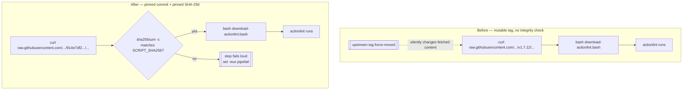

# Pin the actionlint install script to a commit SHA and verify its checksum

## Summary

`.github/workflows/actionlint.yml` fetched actionlint's install script from
`https://raw.githubusercontent.com/rhysd/actionlint/v1.7.12/scripts/download-actionlint.bash`
— a mutable git _tag_, not a commit — and executed it with `bash` on the runner.
A tag can be force-moved by a compromised upstream account, so the job would
have fetched and run whatever the tag resolved to at that moment, with no diff
review, no pin and no integrity check. Every third-party `uses:` in this repo is
already SHA-pinned for exactly that reason; this one fetch escaped the
discipline.

Both remedies the issue suggests are applied, because they close different
holes:

- **SHA-pinned URL** — the URL now names commit
  `914e7df21a07ef503a81201c76d2b11c789d3fca`, the immutable commit the `v1.7.12`
  tag pointed at. GitHub resolves a commit SHA by content, so a moved tag no
  longer changes what is fetched.
- **Pinned SHA-256, verified before execution** — the step checks the download
  against `72fa3e45ac20…` with `sha256sum -c` before `bash` ever sees it, so a
  substituted response (a compromised CDN, an intercepted fetch) fails the step
  instead of running. This mirrors the repo's existing
  `quality/gitleaks_scan.sh` pattern.

The verification fails loud: `sha256sum -c` exits non-zero and the step's
`set -euo pipefail` aborts before the install line, so a mismatch can never be
reconciled as a pass.

Content was confirmed unchanged by the pin — the script served at the tag and at
the commit hash to the same
`72fa3e45ac20f3c3a512d6747b4fcf719e21f890e8c43e78d48a41fdfb900c4e`, so CI
behaviour is identical.

Closes #618.

## Evidence

This is a CI/workflow change with no web interface to screenshot; the evidence
is the regression tests plus a local simulation of the changed shell.

### Install flow, before and after



### Regression tests — red before, green after

Run against the unfixed workflow (3 of the 4 workflow-policy tests fail):

```text
every raw.githubusercontent.com URL in a workflow is pinned to a 40-char commit SHA (#618) ... FAILED
  actionlint.yml: '...rhysd/actionlint/v1.7.12/scripts/download-actionlint.bash' — ref 'v1.7.12' is not a 40-char commit SHA
every downloaded script a workflow executes is checksum-verified first (#618) ... FAILED
  actionlint.yml: step 'Install actionlint' executes download-actionlint.bash without a 'sha256sum -c' check
the actionlint install step pins its script URL and verifies its checksum (#618) ... FAILED
  SCRIPT_URL must resolve a 40-char commit SHA, got 'v1.7.12'
FAILED | 1 passed | 3 failed
```

Run after the fix:

```text
ok | 7 passed | 0 failed (19ms)
```

The detection helpers are also exercised directly, with literal scripts rather
than only the repo's own workflow files. That closed a false negative found in
this run: the shell-invocation regex matched the `bash` tail of the _filename_
on the `curl -o download-actionlint.bash` line, swallowed the newline as its
separator and captured the next line's `bash` as the script, so the checksum
policy passed against the unfixed workflow instead of failing it. With the match
anchored to command position, the policy is red against the unfixed workflow as
shown above.

### The changed shell actually rejects a tampered script

Simulated locally with the exact `SCRIPT_URL` / `SCRIPT_SHA256` pair now in the
workflow:

```text
download-actionlint.bash: OK                 # untampered → verification passes
download-actionlint.bash: FAILED             # one byte appended
sha256sum: WARNING: 1 computed checksum did NOT match
TAMPER-REJECTED-OK (exit 1)                  # non-zero → set -e aborts the step
```

### Full quality gate

`./quality.sh` — `1198 passed | 0 failed` (10s), format, lint, type check, bash
syntax and shellcheck all green, re-run in this session after the test fix.

The pin was re-verified against upstream in this run: the `v1.7.12` tag resolves
to commit `914e7df21a07ef503a81201c76d2b11c789d3fca`
(`gh api repos/rhysd/actionlint/git/refs/tags/v1.7.12`), and the script served
at that commit hashes to the pinned
`72fa3e45ac20f3c3a512d6747b4fcf719e21f890e8c43e78d48a41fdfb900c4e`.

## Original trigger closed

The issue's trigger was: any run reaching the install step executes whatever
`download-actionlint.bash` resolves for the `v1.7.12` ref. That path is closed
statically — the workflow no longer references `v1.7.12` in any URL, so a
force-moved tag changes nothing the job fetches, and the fetched bytes must hash
to a digest pinned in this repo before `bash` is invoked.

There is no trivial bypass. The two guards are independent: defeating the pin
requires a SHA-256 preimage against a specific commit's content, and defeating
the checksum requires editing a value committed to this repo — which is a
reviewed diff, the same trust boundary as the SHA-pinned `uses:` references. The
equivalent bypasses are closed by policy too, across every workflow rather than
only this file: a `curl … | bash` (content unverifiable before it runs) and any
other `raw.githubusercontent.com` tag or branch reference both fail the new
tests, so the flaw cannot reappear in a different workflow or under a different
spelling.

## Test Plan

Added `tests/workflow_remote_script_pinning_test.ts` (seven tests, all new):

- `tests/workflow_remote_script_pinning_test.ts::every raw.githubusercontent.com URL in a workflow is pinned to a 40-char commit SHA (#618)`
  — walks every string leaf of every parsed workflow and rejects any raw URL
  whose ref is not a 40-char commit SHA. **Reproduces the flaw: fails against
  the unfixed workflow** (`ref 'v1.7.12' is not a 40-char commit SHA`) **and
  passes after the fix.**
- `tests/workflow_remote_script_pinning_test.ts::every downloaded script a workflow executes is checksum-verified first (#618)`
  — finds steps that `curl -o`/`wget -O` a file and then run it through a shell,
  and requires a `sha256sum -c` in the same script. Also fails against the
  unfixed workflow and passes after the fix.
- `tests/workflow_remote_script_pinning_test.ts::the actionlint install step pins its script URL and verifies its checksum (#618)`
  — asserts the install step's `SCRIPT_URL` resolves a 40-char SHA, that
  `SCRIPT_SHA256` pins a 64-char digest, and that the digest is fed into the
  verification. Fails against the unfixed workflow, passes after the fix.
- `tests/workflow_remote_script_pinning_test.ts::no workflow step pipes a download straight into a shell (#618)`
  — forward-looking guard against the `curl … | bash` shape, which cannot be
  verified at all. Green both before and after (the repo never used that
  spelling); it exists so the fix cannot be undone by switching form.

Three further tests exercise the detection helpers directly, so the policy
cannot pass by failing to see the pattern it is meant to catch:

- `tests/workflow_remote_script_pinning_test.ts::the checksum policy flags the historical unverified install script (#618)`
  — feeds the verbatim pre-fix install script to `downloadedFiles` and
  `isExecutedByShell` and asserts both detect it. **Fails against the buggy
  shell-invocation regex** (the false negative described above) **and passes
  after it is anchored to command position.**
- `tests/workflow_remote_script_pinning_test.ts::shell-execution detection handles command position and separators (#618)`
  — eight literal cases: `bash x.sh`, `bash -x x.sh`, `sh x.sh --flag`,
  `/bin/bash x.sh`, `… && bash x.sh` (all true), and `cp download.bash …`,
  `./install.sh`, the empty script (all false).
- `tests/workflow_remote_script_pinning_test.ts::download detection finds curl and wget targets (#618)`
  — `curl -o` and `wget -O` targets, a script with no download, and the
  `curl … | bash` pipe shape.

The checks are policy-wide, not fitted to `actionlint.yml`: they parse every
`.github/workflows/*.yml` and would catch the same class in any workflow added
later.

Docs updated in the same change: the README workflow-lint bullet and the
`actionlint.yml` header comment now describe the pinned-commit + checksum
install, and a CHANGELOG entry records the fix.
