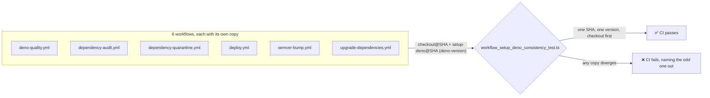

## Summary

The `actions/checkout` + `denoland/setup-deno` preamble is copy-pasted across
six workflows, and the risk the audit named is drift: bump the pin in five
copies and the sixth silently runs a different toolchain, with nothing in CI
noticing. This PR closes that drift gap with a CI gate. Closes #623.

**The suggested extraction is not implementable, and that is the substantive
finding of this run.** Both routes the issue proposes fail for structural
reasons, not stylistic ones:

- **Local composite action** (`.github/actions/setup-deno-env/action.yml`) —
  `uses: ./.github/actions/...` is resolved relative to `$GITHUB_WORKSPACE`, so
  the runner can only read `action.yml` _after_ `actions/checkout` has already
  run. The checkout half of the pair can never live inside it; a workflow that
  tried would fail with
  `Can't find 'action.yml' … under
  '/home/runner/work/…/.github/actions/setup-deno-env'`.
  GitHub's own composite action tutorial shows `actions/checkout` preceding
  every local `uses:` for exactly this reason
  ([docs](https://docs.github.com/actions/creating-actions/creating-a-composite-action)).
- **Reusable workflow** (`uses: ./.github/workflows/setup-deno.yml`) — called at
  the _job_ level and run on its own runner, so it cannot prepare the
  environment for the calling job's remaining steps
  ([docs](https://docs.github.com/en/actions/concepts/workflows-and-actions/reusing-workflow-configurations)).

A third-party or org-level action would work, but is ruled out: it introduces
the cross-repo coupling the coding standards forbid, and it would move six
`uses:` pins out of the reach of this repo's SHA-pinning, Node-runtime and
persist-credentials scanners.

So the duplication stays, and CI now enforces that the copies agree — the idiom
this repo already uses for `actions/checkout` (#293), which enforces one pinned
SHA across every workflow. Three properties are gated:

1. every `denoland/setup-deno` reference resolves to the **same commit SHA**;
2. every `denoland/setup-deno` step requests the **same `deno-version`**, and
   declares one at all rather than inheriting the action's default;
3. no job installs Deno **before** checking the repository out — the pair is
   copied together, so it must stay together.



Note that the checkout half of the pair is already covered by existing gates —
single SHA (#293), `persist-credentials: false` (#588), 40-char pin (#190) — so
between those and this change, every attribute of the duplicated preamble is now
enforced across all six copies.

## Evidence

Backend/CI change with no web interface to screenshot. The evidence is the test
going **red against each way the six copies can drift**, and green once
restored. Each scenario below was produced by editing a real workflow file, then
reverted:

**1. One workflow left on an older `denoland/setup-deno` pin** (`deploy.yml`):

```
error: Expected a single pinned denoland/setup-deno SHA across all workflows, found 2:
  deno-quality.yml: 667a34cdef165d8d2b2e98dde39547c9daac7282
  ...
  deploy.yml: 0000000000000000000000000000000000000000
FAILED | 3 passed | 1 failed
```

**2. One workflow left on a different `deno-version`** (`semver-bump.yml` set to
`v1.x`):

```
error: Expected one requested Deno version across all workflows, found 2:
  deno-quality.yml: quality: v2.x
  ...
  semver-bump.yml: update-version: v1.x
FAILED | 3 passed | 1 failed
```

**3. A copy that lost its checkout** (`dependency-audit.yml`):

```
error: Every job that installs Deno must check the repository out first — the pair is copied together and must stay together:
  dependency-audit.yml: audit
FAILED | 3 passed | 1 failed
```

Full gate after the change:

```
$ ./quality.sh < /dev/null
running 4 tests from ./tests/workflow_setup_deno_consistency_test.ts
workflows install Deno via `denoland/setup-deno` (#623) ... ok
all `denoland/setup-deno` references resolve to one SHA (#623) ... ok
every `denoland/setup-deno` step requests the same Deno version (#623) ... ok
every `denoland/setup-deno` step is preceded by a checkout in its job (#623) ... ok

ok | 1204 passed (68 steps) | 0 failed (13s)
==> OK
```

## Test Plan

Added:

- `tests/workflow_setup_deno_consistency_test.ts` — the four policy tests above,
  parsing the real workflow YAML (no source-text grepping).
- `tests/workflow_helpers_test.ts::setupDenoSteps selects only
  denoland/setup-deno steps`
  — happy path plus the near-miss `denoland/setup-deno-canary`, which the
  `@`-anchored prefix must not match.
- `tests/workflow_helpers_test.ts::setupDenoSteps handles missing jobs and empty
  step lists`
  — the `undefined` / `{}` / `{ steps: [] }` edge cases.

Modified:

- `tests/workflow_helpers.ts` — new `setupDenoSteps()` helper, mirroring the
  existing `checkoutSteps()`.

Docs:

- `CONTRIBUTING.md` — records the policy and why the pair is not extracted, so
  the next reader does not re-attempt the composite action.
- `CHANGELOG.md` — `[Unreleased]` entry.

No existing tests were removed, skipped or weakened.
