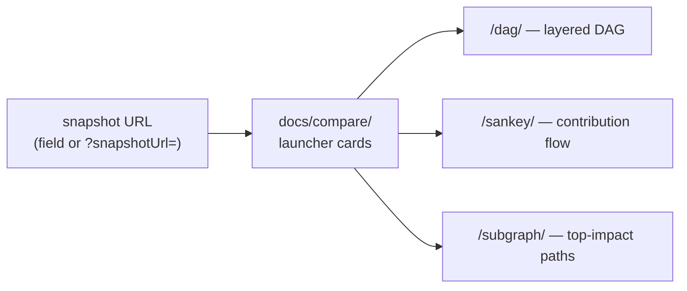

## Summary

`docs/compare/` is a public entry point — linked from the Trace explorer's
overview (`docs/index.html`), registered in `ENTRY_PAGE_DIRS` and precached by
`docs/sw.js` — but the README only mentioned `compare/` inside the "Adding a new
entry page" wiring note, never as a feature a reader can visit. Every sibling
candidate view (Graph, Sankey, DAG, Subgraph) has its own usage section; Compare
had none.

This PR adds a **`## 🔀 Compare graph views (/compare/)`** section to
`README.md` beside those siblings, stating the entry point
(`docs/compare/index.html`), that the page takes one snapshot URL and wires all
three candidate views (`/dag/`, `/sankey/`, `/subgraph/`) to it as launcher
cards, and how a reader reaches it (the "Compare graph views" button on the
Trace explorer, or `/compare/` directly). A new test discovers entry pages from
the filesystem and fails when one is undocumented, so this class of gap cannot
recur silently.

Closes #632.

## Evidence

Documentation-only change — no application code or UI was modified, so there is
no new visual state to capture. Playwright MCP browser tools are not exposed in
this session and no Chromium binary is cached in the container, so no fresh
screenshot was taken; the README section reuses the committed evidence images
that already depict the current launcher-card page
(`docs/evidence/issue-554-compare-*.png`, post-#554).


The section documents this flow:



Test evidence — `tests/readme_entry_page_docs_test.ts` was written first and
observed failing against the unfixed README:

```
error: README.md never mentions docs/compare/ — every entry page needs a usage
section naming its entry point
FAILED | 0 passed | 2 failed
```

After the README section landed:

```
README documents every entry page under docs/ ... ok (4ms)
README documents the compare page's launcher role ... ok (7ms)
ok | 2 passed | 0 failed
```

Full gate: `./quality.sh` → `ok | 1206 passed (68 steps) | 0 failed (13s)` →
`==> OK`.

## Test Plan

- Added `tests/readme_entry_page_docs_test.ts`:
  - `README documents every entry page under docs/` — discovers every directory
    under `docs/` that serves its own `index.html` (the same filesystem
    discovery `tests/entry_page_pwa_wiring_test.ts` uses) and asserts the README
    refers to each by repository path. `starfield/` is an explicitly documented
    alias exception: `docs/starfield/starfield.js` is a thin re-export of
    `docs/graph/graph.js`, covered by the README's Graph explorer section.
  - `README documents the compare page's launcher role` — asserts the README
    names `docs/compare/index.html` and each of the three candidate routes the
    page launches.
- No existing tests were modified or removed.
