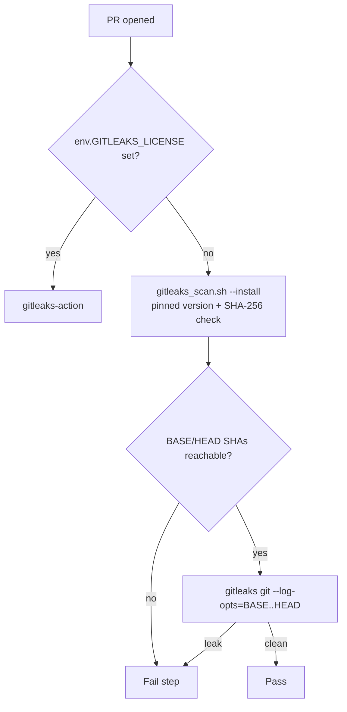

# Licence-less gitleaks CLI fallback for the secret-scan gate

## Summary

`gitleaks/gitleaks-action` was the only scanner in
`.github/workflows/gitleaks.yml`, so the best-practice audit
(`BP-GITLEAKS-NO-FALLBACK-gitleaks`) found no `run:` step invoking the gitleaks
CLI. The workflow now exposes `GITLEAKS_LICENSE` at job level and gates two
steps on it:

- `if: env.GITLEAKS_LICENSE != ''` — the licensed action (unchanged SHA,
  v3.0.0).
- `if: env.GITLEAKS_LICENSE == ''` — the free, open-source CLI. It is installed
  by `quality/gitleaks_scan.sh --install "$RUNNER_TEMP/gitleaks-cli"` at a
  pinned version, verified against the published SHA-256 checksum, then run as
  `gitleaks git --redact --no-banner --exit-code 1 --log-opts="${BASE_SHA}..${HEAD_SHA}" .`

`gitleaks git --log-opts` exits 0 on a range git cannot resolve, so the step
checks both SHAs with `git cat-file -e` first and fails loud rather than passing
over an unscanned diff. The earlier "Detect gitleaks licence" step is replaced
by the job-level env. README's secret-scan bullet is updated.

Making "Gitleaks / gitleaks" a required status check is a ruleset change and is
left for a human.

Closes #651

## Evidence

This is a CI and script change with no web interface, so there is no screenshot.

- `actionlint` and `shellcheck` are clean on the changed files.
- `./quality.sh` passes on a clean archive of the commit:
  `ok | 1209 passed (70 steps) | 0 failed | 1 ignored`, then `==> OK`.

## Test Plan

`tests/gitleaks_licence_fallback_test.ts` (15 tests; the step tests run the real
`run:` block against a temporary repo with a fake, checksummed release):

- The licence is exposed at job level, and the two steps are gated on
  `env.GITLEAKS_LICENSE` in opposite directions.
- The fallback `run:` invokes `gitleaks` in a way that matches the audit's
  CLI-invocation regex. The wrapper name alone does not match.
- The step runs the CLI on the PR range with the exact argv
  `git --redact --no-banner --exit-code 1 --log-opts=<base>..<head> .`
- The step fails when the CLI reports a leak (exit 1).
- The step refuses an unreachable range, and the CLI is never run.
- `--install` places a verified CLI, refuses a tampered download (nothing
  lands), and fails without a destination directory.

The workflow policy suites (persist-credentials, milestone-branch, Node 24)
still pass.
