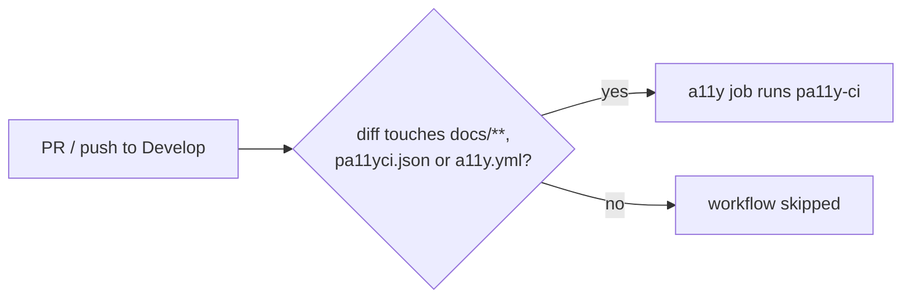

## Summary

`a11y.yml` now runs only when its inputs change. Both the `pull_request` and
`push` triggers carry a `paths:` filter scoped to `docs/**`, `pa11yci.json` and
`.github/workflows/a11y.yml` — the directory the job serves, the pa11y-ci
configuration it scans with, and the workflow itself. A PR confined to
`helpers/`, `scripts/` or `tests/` no longer pays for the ~1.2 minute job.
The workflow is not a required status check (`.github/rulesets/Develop.json`
lists only `update-version`, `quality` and `dependency-quarantine`), so a
skipped run blocks nothing. README updated to match. Closes #652.

## Evidence

CI-configuration change only — no UI to screenshot.

`tests/workflow_a11y_paths_filter_test.ts` failed 4/4 before the workflow
edit and passes 4/4 after. Full `deno test -A` passes (1214 tests);
`deno lint` and `deno check` clean.

<!-- vibe-quality-gate-skipped reason="./quality.sh's `deno fmt --check` step fails only on the locally generated, git-excluded graft/ index directory (not part of the repo or CI); each gate step was re-run with that directory excluded and passed" -->

## Test Plan

- Added `tests/workflow_a11y_paths_filter_test.ts`: for both `pull_request`
  and `push`, asserts the `paths:` allowlist includes all three inputs, that
  `helpers/`, `scripts/`, `tests/` and `README.md` changes do not match, and
  that `docs/` and `pa11yci.json` changes do.
