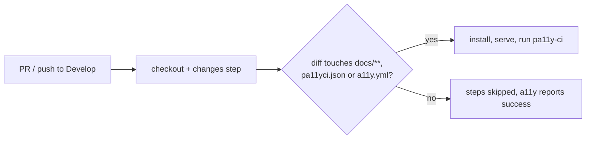

## Summary

`a11y.yml` now skips its scan when its inputs did not change, while still
reporting the required `a11y` check on every PR. `a11y` is a required status
check on the live Develop and milestone rulesets (the checked-in
`.github/rulesets/develop.json` has drifted — #658), so a workflow-level
`paths:` filter would leave non-docs PRs stuck at "Expected". Instead the
triggers stay unfiltered and a `changes` step diffs against the base commit
(`pull_request.base.sha`, or `before` on push); the setup, install, serve and
scan steps run only when `docs/**`, `pa11yci.json` or `a11y.yml` changed. With
no usable base commit (new branch, unreachable SHA) it scans rather than
guesses. A PR confined to `helpers/`, `scripts/` or `tests/` no longer pays for
the ~1.2 minute scan. README updated to match. Closes #652.

## Evidence

CI-configuration change only — no UI to screenshot.

## Test Plan

- `tests/workflow_a11y_paths_filter_test.ts` asserts neither trigger carries a
  `paths:`/`paths-ignore` filter, checkout fetches full history, and every step
  after `changes` is gated on `steps.changes.outputs.scan == 'true'`.
- It executes the `changes` script in a temporary git repo: docs, `pa11yci.json`
  and workflow edits yield `scan=true`; `helpers/`, `scripts/`, `tests/`,
  `README.md`, look-alike paths and empty diffs yield `scan=false`; an empty,
  all-zero or unreachable base SHA yields `scan=true`.
- `actionlint` clean; the six a11y workflow test files pass.
