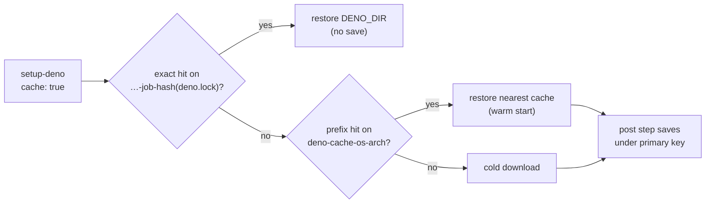

# PR Summary — Issue #653: Deno dependency caching in CI

## Summary

Closes #653.

Six workflows ran `denoland/setup-deno` with no cache, so every run
re-downloaded the whole Deno dependency graph. Each of those steps now sets
setup-deno's built-in `cache: true` input. This avoids a separate
`actions/cache` step and the new action pin it would need.

- **Primary key:** `deno-cache-<os>-<arch>-<job>-<hash of **/deno.lock>`. The
  key is strictly lockfile-scoped, which is the mitigation the issue names for a
  stale cache.
- **Restore key:** `deno-cache-<os>-<arch>`. A miss falls back to the newest
  cache for that prefix, so PR runs restore the one the default branch saved
  instead of starting cold.
- **Save:** a post step saves the cache unless the primary key was an exact hit.

Changed workflows:

- `deno-quality.yml`
- `dependency-audit.yml`
- `dependency-quarantine.yml`
- `deploy.yml`
- `semver-bump.yml`
- `upgrade-dependencies.yml`

The setup-deno pin (`667a34c…`, v2.0.4) is unchanged. None of these workflows
uses `pull_request_target`, so a cache saved by a PR run stays scoped to that
PR's ref and cannot poison the default branch's cache.

- [x] Failing test first (`tests/workflow_deno_cache_test.ts`)
- [x] `cache: true` on all six setup-deno steps
- [x] README CI section updated
- [x] Quality checks

## Evidence

This is a CI-only change, so the evidence is the test run. No visual surface
changed.



`tests/workflow_deno_cache_test.ts` loads every workflow through
`tests/workflow_helpers.ts` and checks each `denoland/setup-deno` step:

- It asserts that at least six such steps exist, so the suite cannot pass
  vacuously.
- It asserts that each step sets `cache: true`.
- It asserts that no step overrides `cache-hash`, since an override would detach
  the key from `deno.lock`.

Red before the change:

```text
workflows - every setup-deno step enables the Deno cache ... FAILED
error: setup-deno without `cache: true`: deno-quality.yml → quality,
  dependency-audit.yml → audit, dependency-quarantine.yml → dependency-quarantine,
  deploy.yml → deploy, semver-bump.yml → update-version,
  upgrade-dependencies.yml → upgrade
```

Green after it: `ok | 8 passed | 0 failed`, together with
`tests/workflow_setup_deno_consistency_test.ts`.

## Test Plan

- `deno test -A tests/workflow_deno_cache_test.ts tests/workflow_setup_deno_consistency_test.ts`
- `./quality.sh` steps: bash syntax, ShellCheck, `deno lint`, `deno check`, and
  `deno test` (1214 passed). `deno fmt --check` ran with `--ignore=graft`,
  because an untracked local `graft/` index directory in the worker checkout
  (not in the repo) fails the formatter. Everything tracked is formatted.
- `actionlint .github/workflows/*.yml` passes.
- After merge, check that the second run of `deno-quality.yml` logs a
  `Cache restored from key: deno-cache-…` line from setup-deno.
