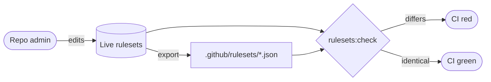

# PR summary — Issue #658: ruleset mirror drift

## Summary

Closes #658.

`.github/rulesets/develop.json` listed `update-version`, `quality` and
`dependency-quarantine`. Live Develop (11243690) requires `update-version`,
`a11y`, `gitleaks`, `markdownlint`, `dependency-review`, `semgrep`, `shellcheck`
and `Quality Gate`. The live milestone ruleset (21880683) had no mirror. #656
trusted the stale file.

- Exported both live rulesets into `.github/rulesets/` (new `milestone.json`).
  Nothing was applied to live.
- `scripts/check_ruleset_drift.ts` + `deno task rulesets:check` fetch the live
  rulesets and diff them against the mirrors. API metadata and array order are
  ignored. `bypass_actors` is compared only when an admin token reveals it.
  Errors and drift both exit 1.
- `.github/workflows/ruleset-drift.yml` runs the check on every PR (no
  `paths:`), nightly and on dispatch.
- `tests/ruleset_required_checks_test.ts` checks that every required context
  names a job with a `pull_request` trigger and no workflow-level
  `paths:`/`paths-ignore:`.
- Updated the tests that pinned the stale contexts (`develop_ruleset_test.ts`,
  `workflow_dependency_quarantine_test.ts`), plus README and CHANGELOG.
- Making `dependency-quarantine` required live is an admin decision, filed as
  #661.



## Checklist

- [x] Export live Develop and milestone rulesets
- [x] Drift checker script, tests and `deno task rulesets:check`
- [x] `ruleset-drift.yml` workflow (PR, nightly, dispatch)
- [x] Required-context / no-`paths:` test
- [x] Fix tests that pinned the stale mirror
- [x] README (Mermaid) and CHANGELOG
- [x] Follow-up #661 for the admin-only quarantine change
- [x] `./quality.sh` green

## Evidence

```text
$ deno task rulesets:check
2 rulesets in sync with stSoftwareAU/NEAT-AI-Explore

# against the old develop.json (exit 1, 11 problems), e.g.
  - develop.json: rules[required_status_checks]...required_status_checks[quality]: only in checked-in file
  - develop.json: rules[required_status_checks]...required_status_checks[dependency-quarantine]: only in checked-in file
  - develop.json: rules[required_status_checks]...required_status_checks[Quality Gate]: only in live
  - develop.json: rules[pull_request].parameters.dismissal_restriction: only in live

$ deno test -A --reporter=dot
ok | 1249 passed (74 steps) | 0 failed
```

## Test Plan

- `deno test -A tests/check_ruleset_drift_test.ts tests/ruleset_required_checks_test.ts`:
  16 tests. They cover the comparison (metadata, order, missing or stale checks,
  scalars, `bypass_actors`), set pairing, fetching with a fake fetcher, loud
  failure on HTTP errors and bad slugs, and CLI parsing.
- `deno task rulesets:check` against the live API.
- `./quality.sh < /dev/null`.

## Deno regression avoided

- The drift check is a Deno script run through `deno task`, with scoped
  permissions. It does not use a Node/`npx` tool or a bash `jq` pipeline.

## Security self-check

- The live API is read-only (`GET`). The workflow has `contents: read`,
  `persist-credentials: false` and SHA-pinned actions, and puts no
  `${{ github.* }}` in `run:`.
- `--repo` is validated against an `owner/name` allowlist regex.
- No secrets are staged. The token is read from `GITHUB_TOKEN` only.
