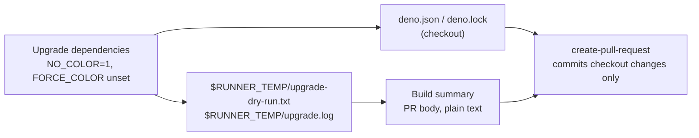

# PR Summary — Issue #660: keep upgrade logs out of the checkout

## Summary

Closes #660.

The `upgrade-dependencies.yml` "Upgrade dependencies" step teed `deno outdated`
output into `upgrade-dry-run.txt` and `upgrade.log` in the checkout root.
`peter-evans/create-pull-request` stages every change in the checkout, so both
files were committed into each bump PR. Because the runner forces colour, they
were full of ANSI escapes, and the dry-run copy also landed in the PR body.

- The step now writes both logs to `$RUNNER_TEMP`, outside the checkout, so they
  are never staged.
- The step runs with `NO_COLOR: "1"` and `unset FORCE_COLOR`, so both logs are
  plain text.
- "Build summary" reads `"$RUNNER_TEMP/upgrade-dry-run.txt"` for the PR body.
- The tracked `upgrade.log` and `upgrade-dry-run.txt` are deleted from the repo
  root.

- [x] Failing test first (`tests/workflow_upgrade_logs_test.ts`)
- [x] Workflow fix
- [x] Tracked logs removed
- [x] Quality gate

## Spec

### Intent and Rationale

A dependency-bump PR should change `deno.json` and `deno.lock` only. Run logs
belong to the run, not the repository, and the PR body should be readable text.

### Essential Design Decisions

- `$RUNNER_TEMP` rather than a `.gitignore` entry: the logs never enter the
  checkout, so no ignore rule or `add-paths` filter has to stay in step with the
  file names.
- `NO_COLOR` is set in the step's `env:` and `FORCE_COLOR` is unset in the
  script. Neither alone is enough when the runner exports `FORCE_COLOR`.
- The test executes the real `run:` scripts from the workflow under a `deno`
  stub, instead of matching the YAML text, so any spelling of the fix that works
  passes and any that does not fails.

### Undiscoverable Facts

Deno 2.9.6 lets any non-empty `FORCE_COLOR`, even `0`, override `NO_COLOR=1`.
Observed locally:

```text
$ env FORCE_COLOR=1 NO_COLOR=1 DENO_DIR=$(mktemp -d) deno info --no-config --no-lock npm:is-number@7.0.0 2>&1 | head -1 | cat -v
^[[0m^[[32mDownload^[[0m https://registry.npmjs.org/is-number
```

`FORCE_COLOR=0` was coloured too. `FORCE_COLOR=` (empty) or unset, with
`NO_COLOR=1`, was plain. `CI`, `GITHUB_ACTIONS` and `CLICOLOR_FORCE` did not
force colour. The deleted `upgrade.log` held ANSI escapes even though its output
went through a pipe, so the test models the runner by exporting `FORCE_COLOR=1`.

## Evidence

This is a CI-only change, so the evidence is the test run. No visual surface
changed.



`tests/workflow_upgrade_logs_test.ts` loads the workflow through
`tests/workflow_helpers.ts` and runs each step's `run:` script with
`bash -e -c`, a clean environment, and a `deno` stub on `PATH`. The stub colours
its output unless `NO_COLOR` is set and `FORCE_COLOR` is empty or unset, as Deno
does. The five tests are:

1. "Upgrade dependencies" leaves the checkout empty.
2. Both logs land in `RUNNER_TEMP`, contain the package table, and have no ANSI
   escapes.
3. "Build summary", run after it, writes the colourless table to
   `GITHUB_OUTPUT`.
4. The harness itself can fail. The old one-liner leaves a coloured file in the
   checkout, and the fixed shape is clean.
5. `upgrade.log` and `upgrade-dry-run.txt` are absent from the repo root.

Red against the unfixed workflow, with the logs still tracked:

```text
FAILED | 1 passed | 4 failed
checkout dir should be empty but has: upgrade-dry-run.txt, upgrade.log
expected RUNNER_TEMP/upgrade-dry-run.txt, found: (none)
GITHUB_OUTPUT should not contain ANSI escapes
upgrade.log should have been deleted from the repo root (#660)
```

Green after the fix: `ok | 5 passed | 0 failed`.

Each part of the fix was removed on its own, with the rest left in place, and
the suite re-run:

| Removed                                   | Tests that went red                         |
| ----------------------------------------- | ------------------------------------------- |
| `unset FORCE_COLOR`                       | 2 (logs colourless), 3 (summary colourless) |
| `NO_COLOR: "1"`                           | 2, 3                                        |
| `$RUNNER_TEMP` on the `upgrade.log` tee   | 1 (checkout empty), 2                       |
| `$RUNNER_TEMP` on the Build summary `cat` | 3                                           |

**Docs sweep** — grep: `upgrade-dry-run.txt`, `upgrade.log`, `NO_COLOR`,
`FORCE_COLOR`, `RUNNER_TEMP`, `upgrade-dependencies`, "Upgrade dependencies",
"Build summary", "dry-run log"; section: `README.md#-github-pages--pwa`
("Auto-bump workflow" bullet, `README.md:92-99`); no hits — the bullet was read
through and stays true, since the dry-run log is still embedded in the PR body
and no sentence says the logs are committed to the checkout

## Test Plan

- `deno test -A tests/workflow_upgrade_logs_test.ts`: 5 passed.
- `./quality.sh < /dev/null`: OK, with 1254 tests passed.
- `actionlint .github/workflows/upgrade-dependencies.yml`: clean.
- Branch outcomes: none added. The workflow change adds no conditions; the
  existing `if: steps.changes.outputs.changed == 'true'` gates are unchanged.
- Removed assertions: none.
- After merge, the next scheduled bump PR should change only `deno.json` and
  `deno.lock`, with a plain-text table in its body.
