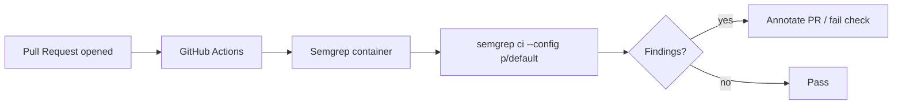

## Summary

Added a Semgrep SAST scanning GitHub Actions workflow that runs on every pull
request, executing `semgrep ci --config p/default` inside the official
`semgrep/semgrep` container. This strengthens the repository's security posture
by catching common code-level vulnerabilities at PR review time. Closes #153.

## Evidence

This is a CI/workflow change with no UI surface. Verification was done via a new
Deno test suite (`tests/semgrep_workflow_test.ts`) that parses the workflow YAML
and asserts on its structure, and via the full quality gate.



Quality gate output:

```
ok | 364 passed | 0 failed (7s)
==> OK
```

## Test Plan

- Added `tests/semgrep_workflow_test.ts` with six checks covering:
  - File presence at `.github/workflows/semgrep.yml`
  - Valid YAML and `name: Semgrep`
  - `pull_request` trigger declared
  - Minimal `contents: read` permission
  - Job runs inside the `semgrep/semgrep` container on `ubuntu-latest`
  - Steps include `actions/checkout@` and a `semgrep ci --config ...` run that
    exposes `SEMGREP_APP_TOKEN` from repository secrets
- Ran `./quality.sh` end-to-end: format check, lint, and 364 tests pass.
