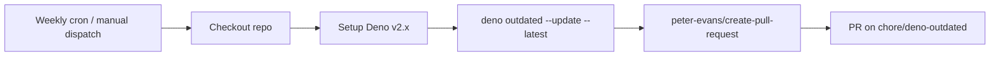

## Summary

Added `.github/workflows/deno-outdated.yml`, a weekly GitHub Actions workflow
that runs `deno outdated --update --latest` and opens a pull request with the
resulting `deno.json` / `deno.lock` changes. This keeps the project on current
Deno standard-library and third-party module versions without manual chasing.
Closes #155.

Third-party actions are pinned to commit SHAs (with the human-readable tag in a
trailing comment) per the repository's supply-chain guidance.

## Evidence

CLI / workflow change — no UI to screenshot. Verified by:

- New unit tests in `tests/deno_outdated_workflow_test.ts` parse the YAML and
  assert the schedule, permissions, and required steps.
- `./quality.sh` passes cleanly (375 tests, 0 failures).

## Test Plan

- Added `tests/deno_outdated_workflow_test.ts` covering:
  - workflow file exists and parses as YAML
  - workflow is named "Deno Dependency Updates"
  - triggers include a weekly `schedule` entry and `workflow_dispatch`
  - `permissions` grants `contents: write` and `pull-requests: write`
  - job runs checkout, `denoland/setup-deno`, `deno outdated --update --latest`,
    and `peter-evans/create-pull-request` with a branch
- `./quality.sh < /dev/null` — passes (fmt, lint, full test suite).
