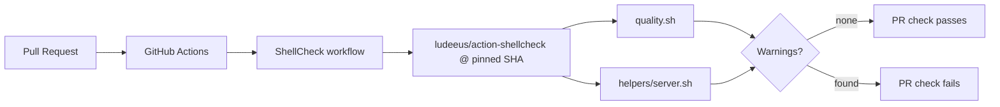

## Summary

Adds a ShellCheck Lint workflow at `.github/workflows/shellcheck.yml` that runs
on every pull request. The workflow scans the repository's shell scripts
(`quality.sh` and `helpers/server.sh`) at `severity: warning` using
`ludeeus/action-shellcheck`.

The third-party action is pinned to a commit SHA rather than the `@master` ref
shown in the issue template — `@master` is a moving target and a documented
supply-chain risk. Closes #156.

## Evidence

This is a CI-only change with no UI surface. Verified by:

- **Local ShellCheck run** —
  `shellcheck --severity=warning quality.sh helpers/server.sh` exits 0, so the
  new gate will be green for the existing scripts.
- **Workflow structure tests** — `tests/shellcheck_workflow_test.ts` parses the
  YAML and asserts the trigger, permissions, job, action, severity, and pinning
  rules.
- **Quality gate** — `./quality.sh` passes with 370/370 tests.

## Test Plan

- Added `tests/shellcheck_workflow_test.ts` with six tests:
  - workflow file exists
  - YAML parses and `name: ShellCheck`
  - triggers on `pull_request`
  - `permissions.contents: read`
  - job uses `actions/checkout` and `ludeeus/action-shellcheck` with
    `severity: warning` and `scandir: .`
  - third-party action is not pinned to `master`/`main`
- Ran `./quality.sh` — all 370 tests pass, format and lint clean.
