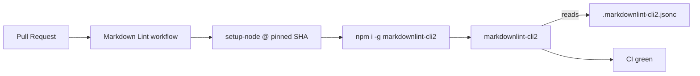

## Summary

Adds a Markdown Lint GitHub Actions workflow plus a repository
`markdownlint-cli2` configuration so authored Markdown is checked on every pull
request. Closes #170.

The workflow installs `markdownlint-cli2` on Node LTS and runs it from the
repository root. Third-party actions (`actions/checkout`, `actions/setup-node`)
are pinned to 40-character commit SHAs in line with the supply-chain rules in
`CLAUDE.md`. The optional Deno/Mermaid validation step from the upstream
template is omitted because this repository has no `worker/deno/mod.ts`.

The `.markdownlint-cli2.jsonc` config:

- Disables `MD013` (line length) — too noisy for prose-heavy READMEs.
- Disables `MD041` (first-line H1) — generated PR-summary files start with
  `## Summary`.
- Ignores `docs/archive/**` and `docs/pr-summary-*.md` so the legacy and
  worker-generated files do not block new PRs. The lint applies to `README.md`
  and any new authored Markdown.

## Evidence

CLI-only change. Verified locally:

```text
$ markdownlint-cli2
Finding: **/*.md !docs/archive/** !docs/pr-summary-*.md !node_modules/**
Linting: 1 file(s)
Summary: 0 error(s)
```

`./quality.sh` passes with **400 tests, 0 failures**.



## Test Plan

- Added `tests/markdown_lint_workflow_test.ts` covering:
  - Workflow file exists and is valid YAML.
  - `name` is `Markdown Lint`.
  - Triggers include `pull_request` and `push`.
  - Permissions limited to `contents: read`.
  - Job runs on `ubuntu-latest`, checks out, sets up Node, installs and invokes
    `markdownlint-cli2`.
  - All `uses:` actions are pinned to 40-character commit SHAs.
  - `.markdownlint-cli2.jsonc` exists and parses as JSON.
- All 400 unit tests pass under `./quality.sh`.
