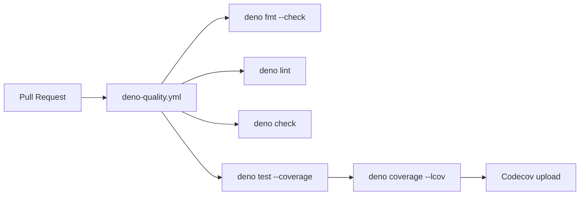

## Summary

Added the `Deno Quality` GitHub Actions workflow at
`.github/workflows/deno-quality.yml` so every pull request — regardless of
target branch — runs `deno fmt --check`, `deno lint`, `deno check`, and
`deno test` with coverage uploaded to Codecov. The existing `Quality Gate`
(`ci.yml`) only runs on PRs targeting `Develop`; this new workflow extends the
same checks to feature-branch PRs and adds Codecov coverage reporting,
addressing the organisation's internal workflow auditor's `deno-quality` sync.
Closes #172.

Third-party actions are pinned to 40-character commit SHAs per the project's
supply-chain policy:

- `actions/checkout@v5.0.1` → `93cb6efe18208431cddfb8368fd83d5badbf9bfd`
- `denoland/setup-deno@v2.0.4` → `667a34cdef165d8d2b2e98dde39547c9daac7282`
- `codecov/codecov-action@v5.5.4` → `aa56896cf108bd10b5eb883cd1d24196da57f695`

The type-check step targets `helpers/ scripts/ tests/` (matching `quality.sh`)
because this repository has no `mod.ts` — the ASCII web viewer ships as static
files under `docs/`.

## Evidence

This is a CI/workflow change with no UI surface to screenshot. `./quality.sh`
passes locally:

```
ok | 411 passed | 0 failed (1s)
==> OK
```

The new workflow is exercised by 11 assertions in
`tests/deno_quality_workflow_test.ts` covering existence, YAML validity, trigger
configuration, permissions, all four Deno quality steps, coverage generation,
Codecov upload, and SHA pinning.



## Test Plan

- Added `tests/deno_quality_workflow_test.ts` with 11 assertions:
  - workflow file exists and parses as YAML
  - name is `Deno Quality`
  - triggers on `pull_request`
  - declares `contents: read` permissions
  - sets up Deno via `denoland/setup-deno`
  - runs `deno fmt --check`, `deno lint`, `deno check`, `deno test --coverage`
  - generates lcov output via `deno coverage --lcov`
  - uploads via `codecov/codecov-action`
  - pins all `uses:` steps to 40-char commit SHAs
- Verified all tests fail before the workflow file is added and pass after.
- Ran the full `./quality.sh` gate: 411 tests pass, fmt/lint/type-check clean.
