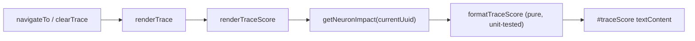

## Summary

Compacts the Trace Explorer header and trace nav for phone viewports (Issue
#184). On screens ≤ 639px wide we:

- Hide the header theme toggle and surface a second theme toggle on the trace
  nav row, so the theme control no longer claims its own row.
- Render a "Score: NN%" badge next to the `Path:` label that reflects the
  current neuron's impact, so phone users see the inbound-allocation score
  without opening the path-summary modal.
- Collapse Observations, 🧠 and Synapses into a `⋯` overflow menu, while Back,
  Clear and the theme toggle stay always visible.

Desktop and tablet layouts are unchanged — the overflow wrapper is
`display: contents` on wider viewports, so its children flow inline as before.

Closes #184.

## Evidence

### Phone (≤ 639px)

Before: header theme toggle on its own row, Path: on its own row, trace buttons
wrapping onto a second row — three+ rows of chrome.

After: header has just the title/status, trace nav fits on two rows with the
Score badge inline next to Path:.

Overflow menu opened from the `⋯` button:

### Tablet (640–1023px)

Unchanged — header retains the theme toggle, trace buttons flow inline.

### Desktop (≥ 1024px)

Unchanged — header retains the theme toggle, trace buttons flow inline.

### Render flow

## Test Plan

- `tests/trace_score_test.ts` — covers `formatTraceScore` happy path, zero,
  negative-fraction edge case, null/undefined/NaN/Infinity guards,
  numeric-string coercion, and full-impact (`1 → 100.0%`).
- Existing `tests/sw_static_files_test.ts` continues to verify `sw.js` precaches
  all shared modules — extended cache list to include the new
  `./shared/trace_score.js`.
- Quality gate (`./quality.sh`) passes: 422 tests, no lint or format errors.

## Files changed

- `docs/index.html` — added `#traceScore` badge, second theme toggle, `⋯`
  overflow menu wrapper.
- `docs/app.js` — wires both theme toggles, renders the score badge from
  `renderTrace`, installs the overflow menu open/close/outside-click handlers.
- `docs/styles.css` — score badge styling, overflow wrapper transparent on
  desktop/tablet and acting as a popup on phone, phone-only show/hide for the
  two theme toggles.
- `docs/shared/theme.js` — `initThemeMode` now accepts `toggleButtonIds` so both
  buttons share one handler.
- `docs/shared/trace_score.js` — pure formatter exported for unit tests.
- `docs/sw.js` — precache the new shared module.
- `tests/trace_score_test.ts` — new tests for the formatter.
