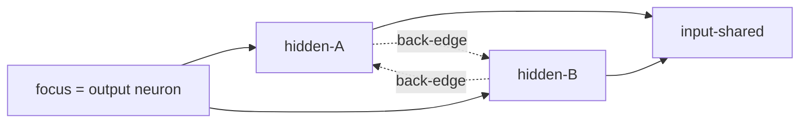

# Reinforce multi-hop observation attribution walk for output neurons

## Summary

Reinforces `computeTopContributingInputs` in `docs/shared/graph_analysis.js` so
it provably sums contribution share across all upstream paths when called from
an output neuron, and hardens the test suite to cover branching, cycle and depth
edge cases. Closes #185.

Concretely:

- Added an explicit **back-edge skip** during the upstream walk. Before
  enqueuing an inbound predecessor we check whether it already appears on the
  current walk's path; if so the edge is a back-edge and is skipped. This
  guarantees termination on recurrent graphs while still allowing the same
  neuron to be attributed along _different_ acyclic paths — which is exactly
  what "sum across all upstream paths" requires.
- Added a doc-comment block to `computeTopContributingInputs` describing the
  chosen cycle-handling mechanism.
- Added an `exhaustive` option that relaxes the per-node fan-out cap, the global
  work cap, the depth cap and the frontier-queue cap. It is intended for the
  small number of output-neuron callers (the consumer in issue #183) and leaves
  defaults unchanged for every other caller.

## Evidence

This is a backend / pure-module change with no UI surface. Verified via the test
suite (see Test Plan). Behaviour for non-output callers is explicitly pinned by
`observation contributions: default behaviour is
unchanged for non-output callers`.

Walks starting from `F` visit `input-shared` via both `A` and `B` and their
normalised shares sum to 1. The dashed back-edges are detected by the
path-membership check and never followed, so the walk terminates.

## Test Plan

Added `tests/observation_contributions_test.ts` covering:

- Multiple paths to the same input sum correctly.
- Cycles produce a finite, deterministic result (and complete well under a 2 s
  budget).
- Deep chains (depth 5) still reach the input.
- Output neurons with only direct input edges attribute 100% across those inputs
  (each input getting an equal third in the test case).
- `exhaustive: true` reaches a 60-wide fan-out that the default
  `maxInboundPerNode: 40` cap would otherwise truncate.
- Default behaviour for non-output callers is unchanged (regression guard
  against the new `exhaustive` defaults).

The existing `tests/attribution_walk_test.ts` continues to pass — verifying the
original two-hop attribution example is unaffected.

Quality gate:

- `./quality.sh < /dev/null` — 441 passed / 0 failed.
