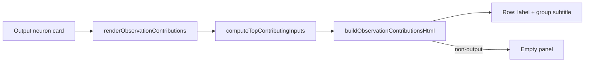

## Summary

Replaces the previous "Top observations → upstream" preview-plus-modal pattern
on neuron cards with a single "Observation contributions" panel that renders
**only on output neuron cards** and lists up to 50 input observations ranked by
their multi-hop share of the output. Each row shows the observation label and,
when present, the `tooltips[].group` as a small subtitle. Closes #186.

The render path is now backed by a new DOM-free module
(`docs/shared/observation_contributions.js`) so the HTML-generation logic is
unit-testable under Deno without a browser. The legacy "Inspect" button and the
matching `openExplainModal` / `renderExplainModal` plumbing (and `#explainModal`
markup) have been removed since they were only ever wired from this panel.

## Evidence

Backend / DOM-string change. No live browser environment is available in this
worker run, so the rendering logic is verified directly against its HTML output:

- `tests/observation_contributions_panel_test.ts` asserts the panel renders for
  output neurons, is empty for hidden / input neurons, caps at 50 rows,
  preserves the descending share order from the caller, includes the group
  subtitle when a group is present, and HTML-escapes both label and group.
- The full `./quality.sh` gate passes (format, lint, type check, **451 tests**).

## Test Plan

- Added `tests/observation_contributions_panel_test.ts` (10 cases):
  - `shouldRenderObservationContributions: only output neurons render`
  - `buildObservationContributionsHtml: empty for hidden neurons`
  - `buildObservationContributionsHtml: empty for input neurons`
  - `buildObservationContributionsHtml: renders for output neurons`
  - `buildObservationContributionsHtml: caps at 50 rows`
  - `buildObservationContributionsHtml: preserves descending order from input`
  - `buildObservationContributionsHtml: empty list produces empty string`
  - `buildObservationContributionsHtml: renders group subtitle when present`
  - `buildObservationContributionsRow: HTML-escapes label and group`
  - `formatSharePercent: formats a fractional share as a percent string`
- `tests/sw_static_files_test.ts` continues to pass after adding
  `./shared/observation_contributions.js` to the SW precache list.
- Full suite: `./quality.sh < /dev/null` → 451 passed.

## Scope Notes

- `docs/index.html`: renamed `#topInputsPanel` →
  `#observationContributionsPanel` and removed the now-orphan `#explainModal`
  markup.
- `docs/app.js`: renamed `el.topInputsPanel` →
  `el.observationContributionsPanel`, renamed `renderTopInputsPanel` →
  `renderObservationContributions`, gated rendering to
  `neuronType === "output"`, removed `openExplainModal` / `closeExplainModal` /
  `renderExplainModal` and their event wiring (only used by this panel).
- `docs/styles.css`: added `.observationContributionsGroup` (small muted
  subtitle) and a thin label wrapper to stack name and group.
- `docs/sw.js`: precaches the new shared module so deploys cannot serve a stale
  `app.js` against a missing helper.
- `README.md`: no change — the previous "Top observations → upstream" wording is
  not documented there.
