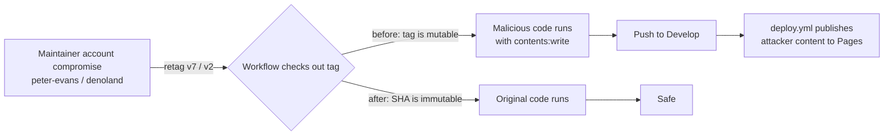

## Summary

Pinned every third-party and first-party GitHub Action `uses:` reference in
`.github/workflows/*.yml` to a 40-character commit SHA, with the human-readable
tag kept as a YAML comment immediately above so dependabot, renovate, and humans
can still see what version is in use. Closes #190.

The highest-impact gap was `upgrade-dependencies.yml` — it declares
`contents: write` + `pull-requests: write`, runs on a weekly cron plus
`workflow_dispatch`, and invoked `peter-evans/create-pull-request@v7` (a
third-party tag). A retag of `v7` would have let an attacker push to `Develop`,
which `deploy.yml` then publishes to GitHub Pages. `denoland/setup-deno@v2` had
a similarly broad blast radius across `ci.yml`, `deploy.yml`, `semver-bump.yml`,
and `upgrade-dependencies.yml`.

The repo already SHA-pins actions in `deno-quality.yml`, `gitleaks.yml`, and
`markdown-lint.yml`; this change brings the remaining workflows in line.

## Evidence

CLI/backend change — no UI to screenshot. Verified via the test suite
(`deno test -A`, 494 tests passing) and the new SHA-pinning tests below.

### SHAs used

| Action                             | Tag (in comment) | Pinned SHA                                 |
| ---------------------------------- | ---------------- | ------------------------------------------ |
| `actions/checkout`                 | `v4.2.2`         | `11bd71901bbe5b1630ceea73d27597364c9af683` |
| `denoland/setup-deno`              | `v2.0.4`         | `667a34cdef165d8d2b2e98dde39547c9daac7282` |
| `peter-evans/create-pull-request`  | `v7.0.11`        | `22a9089034f40e5a961c8808d113e2c98fb63676` |
| `actions/configure-pages`          | `v4.0.0`         | `1f0c5cde4bc74cd7e1254d0cb4de8d49e9068c7d` |
| `actions/upload-pages-artifact`    | `v3.0.1`         | `56afc609e74202658d3ffba0e8f6dda462b719fa` |
| `actions/deploy-pages`             | `v4.0.5`         | `d6db90164ac5ed86f2b6aed7e0febac5b3c0c03e` |
| `actions/dependency-review-action` | `v4.9.0`         | `2031cfc080254a8a887f58cffee85186f0e49e48` |

### Attack-surface closure

## Test Plan

- Added `tests/workflow_action_sha_pinning_test.ts` with two tests:
  - `every workflow pins every action 'uses:' to a 40-char commit SHA (#190)` —
    scans every `.github/workflows/*.yml`, parses YAML, and asserts every
    `uses:` ref matches `/^[0-9a-f]{40}$/`. Confirmed failing before the
    workflow edits and passing after.
  - `workflows that pin to a SHA also include the human-readable tag in a
    comment (#190)`
    — reads the raw YAML and verifies the preceding comment block names
    `<repo>@<tag>` so reviewers and dependency bots can still read the human
    version. Confirmed failing before and passing after.
- Updated the existing
  `tests/upgrade_dependencies_workflow_test.ts::upgrade-dependencies workflow
  opens a PR via peter-evans/create-pull-request@v7`
  test. The previous assertion required the `uses:` string to contain literal
  `v7`, which is incompatible with SHA pinning. The replacement asserts the ref
  is a 40-char SHA; the version is still verified via the new test that requires
  the `# peter-evans/create-pull-request@<tag>` comment alongside the SHA. The
  test name was updated to reflect the new policy. **This is the only
  pre-existing test that was modified — no tests were removed or commented
  out.**
- Full suite: `deno test -A` → 494 passed, 0 failed.
- `deno fmt --check`, `deno lint`, and `deno check helpers/ scripts/ tests/` all
  clean.
