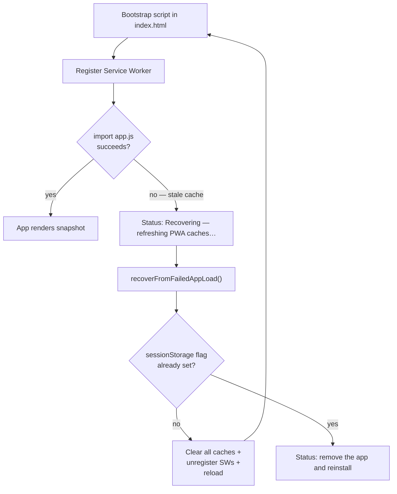

# Issue #194 — PWA self-heal on app-shell load failure

## Summary

The previous error path showed **"Failed to load app — please clear your browser
cache and reload"** when a cached `app.js`/`graph.js` import failed. On an
installed PWA — especially on iOS — that is a dead end: there is no obvious
cache to clear without uninstalling the app, and the last cached model never
gets a chance to render.

This change replaces the dead-end message with an automatic self-heal: clear
every Cache Storage cache, unregister every Service Worker, and reload. A
`sessionStorage` flag guards against an infinite recovery loop if the failure is
not actually cache-related. Closes #194.



## Files changed

- **New**: `docs/shared/pwa_recovery.js` — dependency-injected recovery helper
  (testable in Deno).
- **New**: `tests/pwa_recovery_test.ts` — 13 unit tests covering the happy path,
  loop-guard, and graceful handling of missing
  `sessionStorage`/`caches`/`navigator.serviceWorker`.
- **Modified**: `docs/index.html`, `docs/graph/index.html`,
  `docs/starfield/index.html` — replaced the dead-end error message with a call
  to `recoverFromFailedAppLoad`.
- **Modified**: `docs/sw.js` — added `./shared/pwa_recovery.js` to
  `STATIC_FILES` so the helper is reachable offline.
- **Modified**: `tests/sw_static_files_test.ts` — added regression tests to
  ensure the old "please clear your browser cache" string never reappears in an
  HTML entry point, and that the helper stays in `STATIC_FILES`.

## Evidence

This is a backend/UX change to a bootstrap error path that only fires on a
broken cached deploy. The recovery flow is exercised end-to-end by the unit
tests in `tests/pwa_recovery_test.ts`.

```text
running 13 tests from ./tests/pwa_recovery_test.ts
shouldAttemptRecovery returns true when no flag set ... ok
shouldAttemptRecovery returns false after markRecoveryAttempted ... ok
clearRecoveryFlag removes the flag ... ok
shouldAttemptRecovery handles null storage gracefully ... ok
shouldAttemptRecovery handles throwing storage gracefully ... ok
markRecoveryAttempted handles throwing storage gracefully ... ok
clearAllCaches deletes every cache key ... ok
clearAllCaches with no caches API returns empty list ... ok
unregisterAllServiceWorkers unregisters every registration ... ok
unregisterAllServiceWorkers handles missing container ... ok
recoverFromFailedAppLoad clears caches, unregisters SW, reloads ... ok
recoverFromFailedAppLoad refuses second attempt ... ok
recoverFromFailedAppLoad with no storage still refuses (cannot guard against loop) ... ok
ok | 13 passed | 0 failed
```

Full `./quality.sh` run: **466 passed, 0 failed.**

## Test plan

- [x] `deno test -A tests/pwa_recovery_test.ts` — new unit tests pass.
- [x] `./quality.sh` — full quality gate passes (fmt + lint + 466 tests).
- [x] Regression test in `tests/sw_static_files_test.ts` confirms the misleading
      "please clear your browser cache" wording no longer appears in any HTML
      entry point.
- [x] Regression test confirms `pwa_recovery.js` is precached by the SW so the
      recovery helper is itself reachable when the original failure was caused
      by a stale cache.
