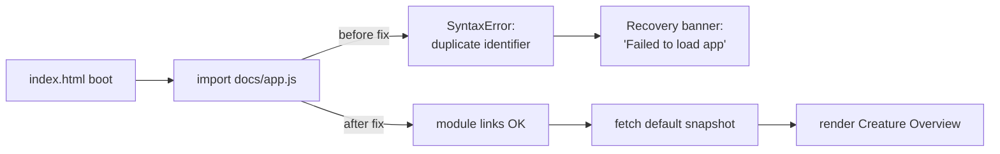

## Summary

Fixes the live regression where https://stsoftwareau.github.io/NEAT-AI-Explore/
showed "Failed to load app" and never fetched the default snapshot. The root
cause was two duplicate top-level identifiers in `docs/app.js`, which made the
browser reject the entire ES module at link time. Closes #200.

- `formatTraceScore` was imported from both `./shared/trace_score.js` and
  `./shared/trace_header.js` (two different functions that happen to share a
  name). The second import is now aliased as `formatPathAllocationScore`, and
  the single call site in `updateTracePathScoreUI` is updated to match.
- `initTraceOverflowMenu` was defined twice. The first definition referenced
  `el.traceOverflow*` properties that do not exist in `index.html` (so it was
  always a no-op); it has been removed. The second definition, which matches the
  actual `.traceOverflow` / `.traceOverflowSummary` markup, is kept.

## Evidence

**Before (live site, broken):**

Console showed:
`SyntaxError: Identifier 'formatTraceScore' has already been declared`

No snapshot fetch was ever attempted because the module failed at link time.

**After (local build, fixed):**

Default snapshot loaded in ~3.4 s; full Creature Overview renders (4,138 neurons
/ 21,075 synapses / 35-layer depth). Zero console errors.

## Test Plan

- Added `tests/app_module_loads_test.ts` — dynamic-imports `docs/app.js` under
  stubbed DOM globals and fails if a `SyntaxError` is raised. Verified it fails
  against the unfixed file and passes after the fix.
- `./quality.sh` — full suite (495 tests) passes.
- Manual: served `docs/` locally, opened with no query params, confirmed the
  default snapshot fetches and renders (screenshot above).
