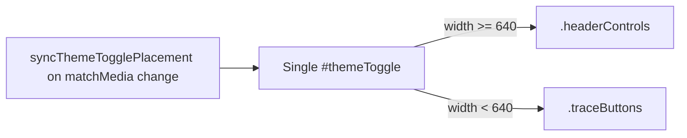

## Summary

Two theme toggles rendered side-by-side in the phone trace nav (both labelled
`A`), and the auto state was shown as the letter `A` rather than an emoji. The
duplicate came from two competing #184 implementations: a second
`#themeToggleTrace` button hidden by CSS, and a JS helper
(`syncThemeTogglePlacement`) that _moves_ the original `#themeToggle` between
header and trace bar. On phone, the JS-moved button landed next to the
already-present trace copy.

This PR consolidates onto the single JS-managed `#themeToggle` and replaces the
glyphs with emojis (`☀️` light, `🌙` dark, `🌓` auto). Closes #204.

## Evidence

### Before (from the issue report)

Two `A` buttons in the trace bar on iPhone (Back, Clear, **A**, ⋯, **A**).

### After — mobile (iPhone 12, 390×844)

Single 🌓 button in the trace bar; header no longer shows a theme toggle.

### After — desktop (1280×720)

Single 🌓 button in the header; trace bar has no theme toggle.

### Architecture

## Test Plan

- `tests/theme_test.ts` — updated `themeModeGlyph` assertions for the new emoji
  glyphs (`☀️` / `🌙` / `🌓`) and added an invalid-input fallback case.
- `tests/theme_button_singleton_test.ts` — new regression test: parses
  `docs/index.html` and asserts exactly one `.themeToggle` button, no
  `#themeToggleTrace`, and the single `#themeToggle` is still present.
- `./quality.sh` — 499 / 499 tests passing, `deno fmt`, `deno lint`,
  `deno check` all clean.
