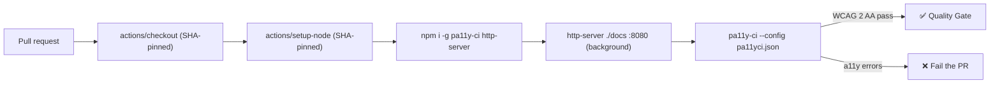

# Add automated accessibility checks to CI (#206)

## Summary

Adds an `Accessibility` GitHub Actions workflow that runs `pa11y-ci` against
the static UI shipped under `docs/` (Explorer, Graph and Starfield viewers) on
every pull request, closing the gap flagged by the `general` bucket's check 9.
The job serves `docs/` over a local `http-server` and lints the three viewer
pages against the WCAG 2 AA standard, so regressions in labels, contrast,
focus traps or ARIA usage fail the PR check before they reach GitHub Pages.
Closes #206.

## Evidence

This is a CI-configuration change with no UI surface to screenshot. Coverage
is verified by new Deno tests that parse `.github/workflows/a11y.yml` and
`pa11yci.json` and assert the expected structure (workflow name, triggers,
permissions, SHA-pinned actions, pa11y-ci install + invoke steps, config
covering all three viewer pages, and a declared WCAG standard).

### Workflow shape

## Test Plan

- `tests/a11y_workflow_test.ts` (new) — nine assertions covering:
  - workflow file exists, parses as YAML and is named `Accessibility`,
  - triggers on `pull_request`,
  - declares minimal `contents: read` permissions,
  - checks out, sets up Node, installs and invokes `pa11y-ci`,
  - pins every third-party action to a 40-char commit SHA,
  - `pa11yci.json` exists, is valid JSON, covers the Explorer, Graph and
    Starfield pages, and declares a WCAG 2 standard.
- Full suite: `./quality.sh` — 510 tests pass (format, lint, type check,
  Deno tests).
- Existing SHA-pinning policy test (`workflow_action_sha_pinning_test.ts`)
  also validates the new workflow automatically.
