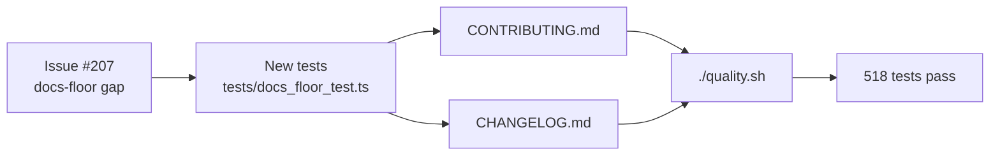

## Summary

Adds the two docs-floor files flagged by the Open Source Guides hygiene check
for non-trivial public repos: `CONTRIBUTING.md` and `CHANGELOG.md`. Closes #207.

- `CONTRIBUTING.md` documents prerequisites, the `Develop` branch model, how to
  run `./quality.sh` (with the underlying `deno fmt` / `deno lint` /
  `deno check` / `deno test` steps), the "what tests vs how tests" rule, the
  `docs/pr-summary-NNN.md` PR convention, the SemVer + `version.json` flow, the
  Australian-English spelling convention, and the supply-chain notes (SHA-pinned
  actions, JSR quarantine).
- `CHANGELOG.md` follows
  [Keep a Changelog](https://keepachangelog.com/en/1.1.0/) with an
  `[Unreleased]` section and an initial `[0.1.0]` entry summarising the
  capabilities present at the current version (`version.json` is the source of
  truth; per-change history before this entry remains in the git log and
  `docs/pr-summary-*.md` files).

Incidental: `deno fmt` reformatted one whitespace-only line wrap in
`docs/archive/pr-summary-206.md` that was already failing the format check on
`Develop`. Including the fix keeps `quality.sh` green.

## Evidence

This is a docs-only change with no UI surface to screenshot. Coverage is
verified by a new Deno test file (`tests/docs_floor_test.ts`) that exercises the
actual filesystem contents — it reads both files and asserts on the sections
required by the issue, and reads `version.json` to confirm `CHANGELOG.md` has an
entry for the current version.

Quality gate result: `./quality.sh` — 518 passed | 0 failed.

## Test Plan

- New file `tests/docs_floor_test.ts` (8 tests):
  - `CONTRIBUTING.md exists at repo root`
  - `CONTRIBUTING.md documents the Develop branch workflow`
  - `CONTRIBUTING.md documents how to run quality.sh`
  - `CONTRIBUTING.md documents deno fmt and deno lint`
  - `CONTRIBUTING.md documents the PR-summary convention`
  - `CHANGELOG.md exists at repo root`
  - `CHANGELOG.md follows keepachangelog.com format`
  - `CHANGELOG.md contains an entry for the current version` (reads
    `version.json` so the assertion stays valid as the version is bumped).
- Full suite: `./quality.sh < /dev/null` — 518 tests pass (format, lint, type
  check, Deno tests).
