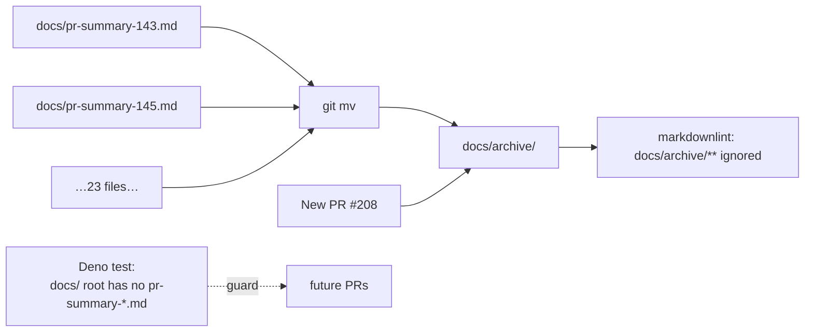

## Summary

Moved the 23 historical PR-summary files (`pr-summary-143.md` …
`pr-summary-204.md`) out of `docs/` root and into `docs/archive/`, matching the
convention already established for PRs #84–#130. Added a Deno test that fails if
any future `pr-summary-*.md` is committed to `docs/` root, so the convention is
enforced going forward. Trimmed the now-redundant `docs/pr-summary-*.md` entry
from the markdownlint ignore list. Closes #208.

Per the new convention, this PR summary itself lives at
`docs/archive/pr-summary-208.md` rather than `docs/pr-summary-208.md`.

## Evidence

CLI / repo-structure change only — no UI. Verified by:

- `./quality.sh` passes: format, lint, type check, and **501 tests** green
  (including the two new tests in `tests/pr_summary_archive_test.ts`).
- `git mv` preserved file history for every moved summary.
- `docs/` root now contains only deployed PWA assets plus `archive/`,
  `evidence/`, `screenshots/`, `shared/`, `starfield/`, `icons/`, `vendor/`, and
  `graph/`.

## Test Plan

- Added `tests/pr_summary_archive_test.ts` with two tests:
  - `docs/ root contains no pr-summary-*.md files` — fails if any
    `pr-summary-NNN.md` is committed to `docs/` root.
  - `docs/archive/ contains pr-summary entries (convention is
    established)`
    — guards against the archive itself being emptied.
- Verified TDD: ran the new test on `Develop`'s state before the move and
  confirmed it failed listing all 23 offending files, then re-ran after `git mv`
  and confirmed it passes.
- Re-ran full quality gate (`./quality.sh < /dev/null`) — 501 tests passing.

## Follow-up

The worker harness that generates new `pr-summary-NNN.md` files writes to
`docs/pr-summary-NNN.md` by default. This PR sidesteps that by writing to
`docs/archive/pr-summary-208.md`. If a future run regresses and writes to
`docs/` root, the new test will fail the quality gate and the worker will need
to move the file under `docs/archive/` before the PR can pass.
