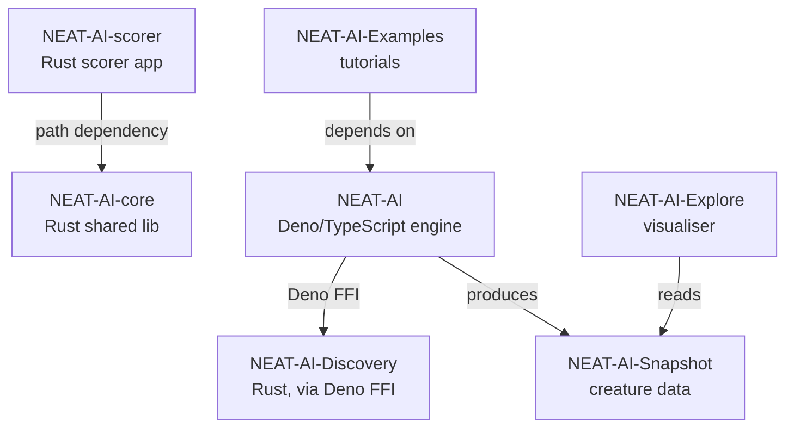

## Summary

Added a `## Related Repositories` section to the NEAT-AI-Explore README using
the canonical block defined in stSoftwareAU/NEAT-AI-core#18. The section lists
all seven public NEAT-AI-* repositories with one-line descriptions and includes
the canonical Mermaid dependency diagram. Inserted just before the Licence
section so it sits alongside other project-wide metadata. Closes #150.

Also formatted three pre-existing unformatted HTML files (`docs/index.html`,
`docs/graph/index.html`, `docs/starfield/index.html`) so the quality gate
passes — these were already failing on `Develop` and were unrelated to the
README change.

## Evidence

Documentation-only change. The new section renders the canonical Mermaid
dependency graph below; GitHub renders Mermaid natively so the diagram is
visible in the README.

`./quality.sh` passes cleanly: `ok | 358 passed | 0 failed`.

## Test Plan

- [x] `./quality.sh < /dev/null` passes (deno fmt, deno lint, deno test).
- [x] README renders correctly with the new section before the Licence.
- [x] Mermaid block matches the canonical diagram from
      stSoftwareAU/NEAT-AI-core#18 verbatim.
- [x] All seven NEAT-AI-* repositories listed with links and roles.
