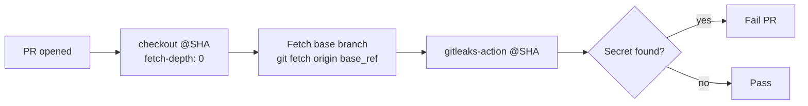

## Summary

Updated `.github/workflows/gitleaks.yml` to match the canonical NEAT-AI
pattern: pinned `actions/checkout` and `gitleaks/gitleaks-action` to
40-character commit SHAs (Issue #1756), and added a `Fetch base branch`
step so gitleaks-action's `<base_sha>^..<head_sha>` range resolves on
the runner. Closes #167.

## Evidence

CLI-only change — no UI to screenshot. Verified by added unit tests
exercising the workflow YAML directly (`tests/gitleaks_workflow_test.ts`).



Quality gate output:

```
ok | 393 passed | 0 failed (5s)
==> OK
```

## Test Plan

- Added `gitleaks workflow pins third-party actions to commit SHAs` —
  asserts every `uses:` step ends in a 40-character hex SHA, so a
  reviewer accidentally downgrading to a `@vN` tag fails CI.
- Added `gitleaks workflow fetches PR base branch before scanning` —
  asserts a `git fetch origin` step exists, is guarded by a
  `pull_request` event check, and is ordered between the checkout and
  gitleaks-action steps.
- Existing five gitleaks workflow tests continue to pass unchanged.
