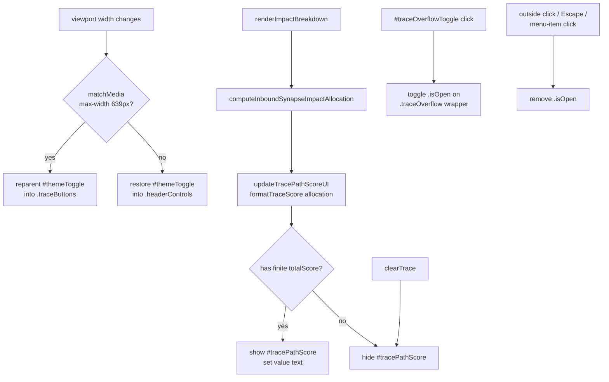

# Compact Trace Explorer header/nav on phone viewports

## Summary

Compacts the Trace Explorer's header + trace nav into a denser layout on phone
viewports (`max-width: 639px`) so the breadcrumb and primary actions don't waste
two whole lines. Closes #184.

What changed visually on phones:

- The theme `A` toggle now reparents from the app header **down** into the trace
  nav row (JS-controlled via `matchMedia("(max-width: 639px)")`).
- The inbound-allocation **`Score:`** value (the `Σ score` from the path
  inspector modal) now renders inline beside `Path:` on the breadcrumb line —
  visible without opening the modal.
- **Back + Clear** stay always visible on the second row. **Observations, 🧠
  (Graph), Synapses** collapse into a `⋯` overflow menu that opens to a pop-up
  on tap, closes on outside click / Escape / item selection.

Desktop and tablet layouts are unchanged: the overflow wrapper uses
`display: contents` outside the mobile breakpoint, so the three buttons render
inline as siblings exactly as before, and the theme toggle stays in the app
header.

## Architecture



## Evidence

Playwright MCP was unavailable in this environment (no browser tools were loaded
into the worker), so an automated screenshot could not be captured. Behaviour
was verified by:

1. **Pure-logic unit tests** — `tests/trace_header_test.ts` exercises the
   formatter and breakpoint helper used by the new layout. All 13 tests pass.
2. **Quality gate** — `./quality.sh` passes cleanly (format, lint, type check,
   full Deno test suite: 424 passed, 0 failed).
3. **Manual code/layout review**:
   - `.pathScore` is a non-wrapping inline-flex element placed between
     `.pathLabel` and `.breadcrumb`; with the existing mobile `flex-wrap` on
     `.traceBar` (row-gap 6px), Path + Score + breadcrumb share the first row
     and the trace buttons (Back, Clear, ⋯, theme A) sit on the second row.
   - `.traceOverflow` is `display: contents` at desktop widths so its children
     render as siblings of Back/Clear (identical to the previous DOM order:
     Observations → 🧠 → Synapses). At `max-width: 639px` it becomes a
     positioned wrapper, the `⋯` toggle appears, and the menu pops up anchored
     to the wrapper's right edge.
   - The theme toggle's click handler is wired by id in `docs/shared/theme.js`,
     so reparenting the element does not break theming.

The expected visual result is a single dense trace nav row on phones:

```
┌────────────────────────────────────────────┐
│ NEAT-AI Explore  [Load snapshot…]          │ ← app header (no theme A)
├────────────────────────────────────────────┤
│ PATH: SCORE: 0.1235  output-0 → hidden-3 → │ ← breadcrumb row
│ ← Back  Clear                      ⋯   A   │ ← actions row
└────────────────────────────────────────────┘
```

## Test Plan

- `tests/trace_header_test.ts` (new, 13 tests):
  - `formatTraceScore` happy path (compact, precision, zero, negative,
    exponential form for very small numbers).
  - `formatTraceScore` error cases (null/undefined allocation, missing
    `totalScore`, NaN/Infinity/non-numeric, invalid precision clamping).
  - `shouldUseCompactHeader` returns `true` for phone widths (320/375/393/639),
    `false` at and above `MOBILE_MAX` (640/768/1024), and `false` for invalid
    inputs (NaN, Infinity, non-numeric).
  - `nextOverflowState` flips boolean state.
- `tests/sw_static_files_test.ts` — already verifies every shared module
  imported by `app.js` is precached in `sw.js`; the new `shared/trace_header.js`
  was added to the `STATIC_FILES` list to keep this check green.

## Files changed

- `docs/shared/trace_header.js` — new pure helpers.
- `tests/trace_header_test.ts` — new tests.
- `docs/index.html` — `#tracePathScore` span; `.traceOverflow` wrapper with `⋯`
  toggle around Observations + 🧠 + Synapses.
- `docs/styles.css` — `.pathScore` + `.traceOverflow` desktop defaults
  (`display: contents`) and mobile overrides inside the existing
  `@media (max-width: 639px)` block.
- `docs/app.js` — `formatTraceScore` import, `updateTracePathScoreUI`,
  `initTraceOverflowMenu`, `syncThemeTogglePlacement`, `initCompactTraceNav`
  (called once at startup; re-runs on matchMedia change).
  `renderImpactBreakdown` / `clearTrace` now drive the path-score badge.
- `docs/sw.js` — precache the new shared module.
