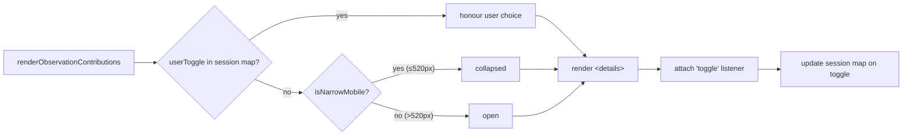

# Collapse Observation contributions panel by default on phone viewports

## Summary

Wraps the "Observation contributions" panel in a native `
`/`
` element so it can be collapsed without extra JS. The default open/closed state tracks the phone breakpoint: collapsed on `≤520px` (matching `isNarrowMobile()`, in line with the compact-layout decisions from #184) and open on tablet/desktop. A user's manual expand/collapse is remembered in a session-scoped `Map<uuid, "open"|"closed">` in `docs/app.js` so re-renders preserve the choice. Closes #187.

## Evidence

Pure helper render output, side-by-side:

- **Phone viewport (top frame, 360px wide):** `
` rendered without the `open` attribute; only the summary `▸ Observation contributions (top 5)` is visible.
- **Desktop viewport (bottom frame, 900px wide):** `
` rendered with `open`; summary caret rotates to `▾` and the full ranked list of observation contributions is visible.

## Test Plan

Added to `tests/observation_contributions_panel_test.ts`:

- `isObservationContributionsOpen: open on desktop by default`
- `isObservationContributionsOpen: collapsed on phone by default`
- `isObservationContributionsOpen: user toggle wins over viewport default`
- `buildObservationContributionsHtml: wraps body in 
 with summary`
- `buildObservationContributionsHtml: collapsed by default on phone viewports`
- `buildObservationContributionsHtml: open by default on desktop viewports`
- `buildObservationContributionsHtml: user 'open' override persists across re-render on phone`
- `buildObservationContributionsHtml: user 'closed' override persists across re-render on desktop`
- `buildObservationContributionsHtml: data-uuid is set on the 
 element`

Full quality gate (`./quality.sh < /dev/null`) — 475 tests pass.

## Acceptance Criteria

- [x] On phone viewports the "Observation contributions" panel is collapsed by default.
- [x] On tablet/desktop viewports the panel is open by default.
- [x] A user can manually expand/collapse the panel and the choice survives a re-render in the same session (`OBSERVATION_CONTRIBUTIONS_TOGGLE` map in `docs/app.js`, updated by a `toggle` event listener).
- [x] Native `
/
` used; no keyboard regressions.
- [x] Tests cover default-collapsed (phone), default-open (desktop), and toggle persistence.
- [x] `./quality.sh` passes.
