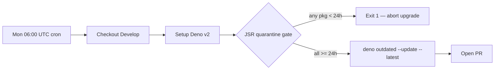

## Summary

Adds a JSR dependency quarantine gate to the weekly auto-bump workflow so a
malicious version published to JSR in the hours before the Monday 06:00 UTC
cron cannot be ingested into `deno.json` / `deno.lock`. Closes #189.

A new `scripts/jsr_quarantine_check.ts` parses every `jsr:` specifier in
`deno.json`, queries the JSR registry for each external package's most
recently published, non-yanked version, and exits non-zero if any package's
latest version is younger than `VIBE_BUMP_QUARANTINE_HOURS` (default 24h).
`stSoftwareAU/*` scopes bypass the gate as internal per house policy. The
`.github/workflows/upgrade-dependencies.yml` workflow runs this script with
`--allow-net=api.jsr.io` immediately before `deno outdated --update --latest`.

## Evidence

This is a backend/CI change with no web UI — no screenshot applies. The
verification is the test suite (12 unit tests for the script plus 1 new
workflow-shape test); `./quality.sh` passes with **492 tests, 0 failed**.

## Test Plan

- `tests/jsr_quarantine_check_test.ts` — 12 new tests covering
  `parseJsrImports` (extraction, deduplication), `isInternal`
  (case-insensitive stSoftwareAU match), `checkQuarantine` (blocked / cleared
  / yanked-version-skipping / bare-array response / registry error / no
  usable versions), and `checkAll` (skips internal scopes, splits
  blocked/cleared, honours the configured window).
- `tests/upgrade_dependencies_workflow_test.ts` — 1 new test asserting the
  workflow runs `scripts/jsr_quarantine_check.ts` *before* `deno outdated`,
  sets `VIBE_BUMP_QUARANTINE_HOURS`, and restricts `--allow-net` to
  `api.jsr.io`.
- All pre-existing tests continue to pass (`./quality.sh`: 492 / 492).
